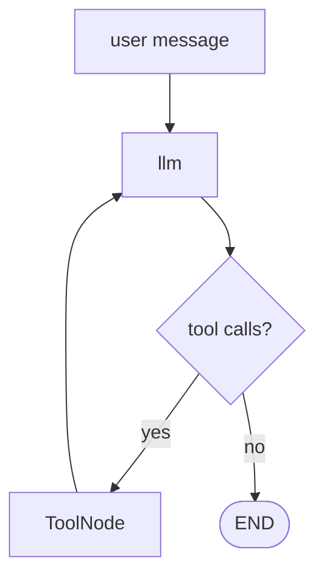
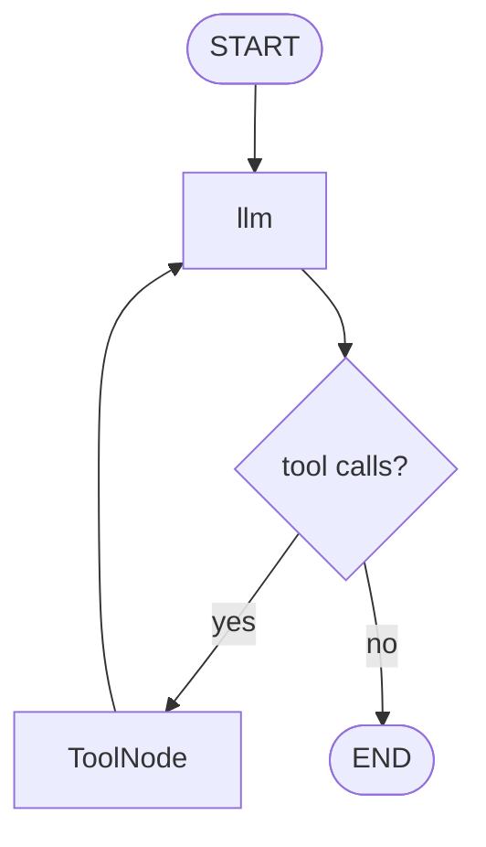
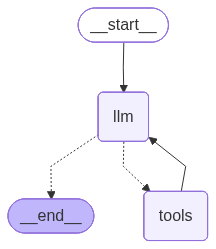

# 01. Tool-Calling Agent — Full (ToolNode + External APIs)

This tutorial shows a simple **tool-calling agent** in LangGraph.

The agent can use:

- `get_weather` for live weather through OpenWeatherMap
- `calculate_tip` for deterministic math
- optional `TavilySearch` for web search if configured

## Part 1 — Core Tutorial

A tool-calling agent is different from a fixed workflow because the model controls whether the loop continues.

The hand-drawn view below shows the loop: the LLM chooses an action, the tool returns feedback, and the LLM decides whether to continue or answer.




The key loop is:

```text
llm -> should_use_tools -> tools -> llm
```

The graph does not know ahead of time how many tool calls will happen. The LLM decides at runtime:

- if it needs a tool, it emits a tool call
- `ToolNode` runs the matching Python function
- the tool result is appended to `messages`
- the LLM reads that result and either calls another tool or gives the final answer

## Workflow vs Agent

Tool binding alone is an **LLM augmentation**. It gives the model access to tools.

The loop makes it an **agent**. The model can decide whether to use tools, which tools to use, and whether to keep going.

So:

- `llm.bind_tools(tools)` = augmentation
- `llm -> tools -> llm` until no tool calls = agent loop

## Part 2 — Code Example That Reinforces The Concept

File:

```text
01_tool_calling_agent.py
```


Graph from the code:



Generated LangGraph plot from the code:



Run from the repo root:

```bash
python "6-Agents/01_tool_calling_agent.py"
```

The example runs prompts like:

```python
"What's the weather in London?"
"Calculate a 20% tip on a $50 bill"
"Search for the latest news about AI agents"
```

The search prompt only runs when both are true:

- `langchain-tavily` is installed
- `TAVILY_API_KEY` exists in `.env`

## Setup

This example needs an OpenAI API key:

```bash
OPENAI_API_KEY=your_api_key_here
```

For live weather, add:

```bash
OPENWEATHER_API_KEY=your_openweather_key_here
```

For web search, also add:

```bash
TAVILY_API_KEY=your_tavily_key_here
```

## Code Explanation

```python
@tool
def get_weather(destination_city: str) -> str:
    ...
```

`@tool` exposes a Python function to the model with a name, description, and argument schema.

```python
llm_with_tools = llm.bind_tools(tools)
```

`bind_tools()` tells the model which tools are available. It does not run tools directly; it lets the model request tool calls.

```python
class AgentState(TypedDict):
    messages: Annotated[list, add_messages]
```

The agent state stores conversation history. `add_messages` appends user messages, AI messages, tool calls, and tool results.

```python
def call_llm(state: AgentState) -> dict:
    response = llm_with_tools.invoke(state["messages"])
    return {"messages": [response]}
```

The LLM node reads the current messages and decides what to do next.

```python
tool_node = ToolNode(tools)
```

`ToolNode` executes whichever tool the latest AI message requested.

```python
def should_use_tools(state: AgentState) -> str:
    last_message = state["messages"][-1]
    if getattr(last_message, "tool_calls", None):
        return "tools"
    return END
```

This router checks whether the LLM requested tools.

```python
graph_builder.add_edge("tools", "llm")
```

After a tool runs, the graph returns to the LLM. That loop is why this belongs in the Agents section.
