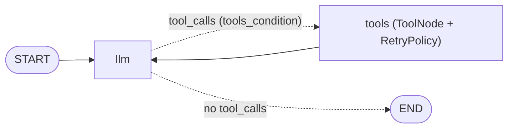

# 04. RAG as a Tool — Let the Model Decide When to Search

Tutorial 5's [`01_rag_retrieve_generate.py`](../5-Workflows/01_rag_retrieve_generate.py) retrieves on **every** question because you wired `START → retrieve → generate`. This example builds the **same FAISS index** (repo-root [`rag_index.py`](../rag_index.py)) but hands it to the model as a tool, `search_docs`. Now the model decides whether to search, what to search for, and how many searches to run.

| | Workflow RAG (tutorial 5) | RAG as a tool (this file) |
|---|---|---|
| Who decides to retrieve | your edges — always | the model — per question |
| Searches per question | exactly one | zero, one, or several (in parallel) |
| Query sent to the index | the user's question verbatim | a query the model writes |
| Best for | every question needs the docs | some questions need the docs |

## Architecture



## What To Look For In The Code

| Concept | Code |
|---|---|
| The tool's contract (what the model sees) | `SearchDocsInput` + the `search_docs` docstring |
| Input validation | `k: int = Field(ge=1, le=5)` — bad values go back to the model as an error message |
| Tool over a prebuilt index | `make_search_tool(vectorstore)` closure |
| Text for the model, data for your code | `response_format="content_and_artifact"` → `ToolMessage.artifact` |
| Prebuilt routing | `add_conditional_edges("llm", tools_condition)` |
| Transient failures | `RetryPolicy(retry_on=ConnectionError)` on the `tools` node |
| A hard cap on laps | `config={"recursion_limit": 10}` |

## Expected Behaviour

| Question | What the model should do |
|---|---|
| Q1 prompt injection | 1 `search_docs` call, answer cites `[Chunk N]` |
| Q2 compare LLM01 and LLM02 | 2 `search_docs` calls in the same turn (parallel) |
| Q3 capital of Canada | no tool call |
| Q4 gateway layer (simulated outage) | first attempt raises `ConnectionError`, retried, answer arrives |

Run from the repo root (needs `OPENAI_API_KEY` for chat and embeddings):

```bash
python "6-Agents/04_rag_as_tool.py"
```

To **see** which tools ran, use tutorial 10's package ([`../10-observability/03_multi_tool_agent/`](../10-observability/03_multi_tool_agent/)): same FAISS helper, plus web search, traces in LangSmith.

Covered in the book in Chapter 8 (Agents). The `search_docs` tool itself lives in [`doc_tools.py`](doc_tools.py) and is introduced in Chapter 7 (Tools).
