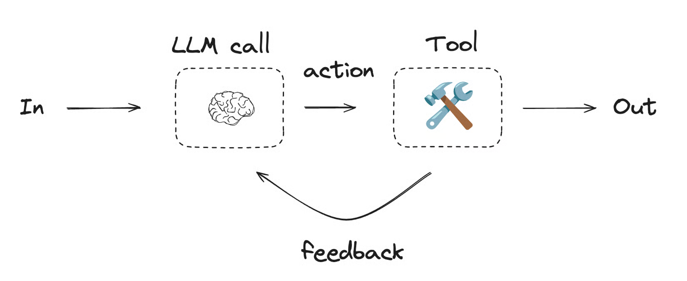
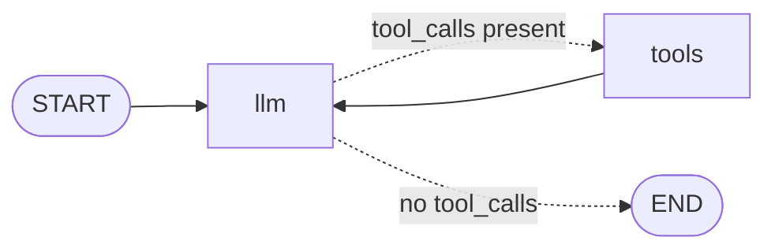
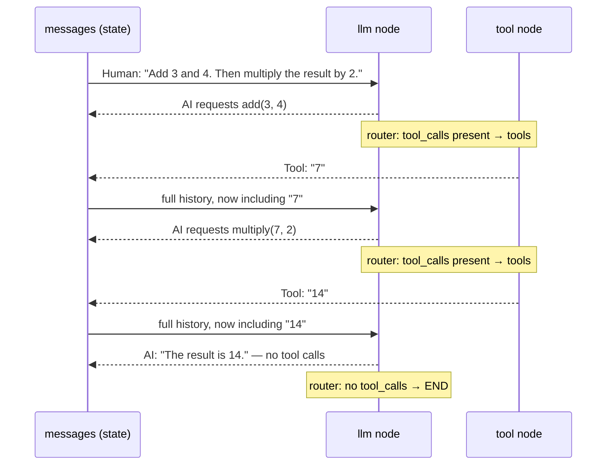

# 6. Agents — Letting the Model Drive the Loop

**Example files:**
- [`00_tool_calling_agent_simple.py`](00_tool_calling_agent_simple.py) — the agent loop built by hand (start here)
- [`01_tool_calling_agent.py`](01_tool_calling_agent.py) — the same loop with LangGraph's prebuilt `ToolNode`, real external APIs, and optional web search

**Requires:** `OPENAI_API_KEY` in the repo-root `.env`. Optional: `OPENWEATHER_API_KEY` (live weather) and `TAVILY_API_KEY` (web search) — the second example degrades gracefully without them.

Every graph in tutorials 1–5 had one thing in common: *you* decided the possible paths at build time. An agent flips that. The graph becomes a tiny loop, and the **model** decides — on every iteration — whether to act again or finish. This tutorial builds that loop twice: once by hand so nothing is hidden, then with the prebuilt components you'd use in practice.

## The Concept: The Tool-Calling Loop

**What is it?** An agent is an LLM in a loop with tools. Each cycle: the model reads the conversation so far, and either (a) requests one or more tool calls, or (b) answers directly. Tool results are appended to the conversation and the model is called again. The loop ends when the model stops requesting tools.

```text
        ┌──────────────────────────────┐
        ▼                              │
   llm call ──"wants tools?"──yes──► run tools
        │                              (results appended
        no                              to messages)
        ▼
       END (last message is the answer)
```

**What problem does it solve?** Models can't fetch live data, do exact arithmetic reliably, or act on the world. Tools fix that — but *which* tools, in *what order*, *how many times* depends on the question. "Add 3 and 4, then multiply the result by 2" needs two dependent calls; "what's 2+2" needs none. You can't wire that variability as static edges. The agent loop moves the sequencing decision into the model.

**When is it appropriate?** Open-ended tasks where the required steps genuinely vary per request and can't be enumerated: multi-step lookups, research, "use whatever tool fits" assistants.

**When is it not?** If you *can* enumerate the paths, a workflow (tutorial 5) is more predictable, cheaper, and easier to debug. An agent buys flexibility at the price of nondeterminism — the same input can take different routes, cost is unbounded without a cap, and failures are harder to reproduce.

| | Workflow (tutorial 5) | Agent (this tutorial) |
|---|---|---|
| Who picks the next step | your edges | the model, every iteration |
| Iteration count | known / bounded | decided at runtime |
| Same input → same path? | essentially yes | not guaranteed |
| Cost | predictable | variable — cap it (Exercise 2) |

**Intuition:** a workflow is a form with a fixed set of checkboxes. An agent is an intern with a phone: you give them a request and a contact list (the tools), and they decide who to call, in what order, and when they have enough to report back. Powerful — and exactly why you give interns a budget.



## Architecture

Both example files compile to the *same* two-node shape:



| Piece | Simple version | Full version | Role |
|---|---|---|---|
| LLM node | `llm_call` | `call_llm` | sends full history to the tool-bound model, appends its reply |
| Tool node | hand-written `tool_node` | prebuilt `ToolNode(tools)` | executes requested tools, appends `ToolMessage` results |
| Router | `should_continue` | `should_use_tools` | inspects the last message: tools or END |
| Back edge | `tool_node → llm_call` | `tools → llm` | closes the loop — results always return to the model |

The state is just tutorial 3's message history (`MessagesState` / `messages` + `add_messages`). The entire conversation — human question, AI tool requests, tool results, final answer — accumulates in one list, which is precisely what lets a stateless model "remember" what its tools just told it.

## Code Highlights

### `@tool` — a docstring is the API contract

```python
@tool
def multiply(a: int, b: int) -> int:
    """Multiply a and b."""
    return a * b
```

The decorator converts a plain function into a tool the model can request by name. The **docstring and type hints are not decoration** — they are serialized into the model's context and are the only thing the model knows about the tool. A vague docstring produces an agent that picks the wrong tool or the wrong arguments. Treat tool signatures like a public API.

### `bind_tools` — advertising, not executing

```python
llm_with_tools = llm.bind_tools(tools)
```

Binding tells the model what it *may* request. The model never runs anything — it replies with a structured `tool_calls` list (names + arguments) on its `AIMessage`. Executing those requests is the graph's job. This split is the security and control boundary of the whole pattern: the model proposes, your code disposes.

### The hand-written tool node — what `ToolNode` hides

From the simple version:

```python
def tool_node(state: MessagesState):
    result = []
    last_message = state["messages"][-1]
    for tool_call in getattr(last_message, "tool_calls", []):
        t = tools_by_name[tool_call["name"]]
        observation = t.invoke(tool_call["args"])
        result.append(ToolMessage(content=str(observation), tool_call_id=tool_call["id"]))
    return {"messages": result}
```

Read it once carefully — it's the whole trick: look up each requested tool by name, run it with the model's arguments, wrap each result in a `ToolMessage` carrying the matching `tool_call_id`. That ID is how the model pairs results with requests when several tools run in one turn. The full version replaces all of this with one line — `ToolNode(tools)` — which does the same job plus error handling. Having seen the manual version, the prebuilt is no longer magic.

### The router — reading the model's decision

```python
def should_use_tools(state: AgentState) -> str:
    last_message = state["messages"][-1]
    if getattr(last_message, "tool_calls", None):
        return "tools"
    return END
```

Note what this router does *not* do: it makes no judgment of its own. The decision was already made by the model (tool calls present or absent on its last message); the router just translates it into graph terms. Same node/router split as tutorial 4 — evidence in state, trivial routing on top.

### The back edge — one line makes it an agent

```python
graph_builder.add_edge("tools", "llm")
```

Delete this edge and you have a workflow: LLM → at most one round of tools → done. With it, results flow back to the model, which can chain calls — use the output of `add` as input to `multiply`, or fetch the weather and *then* decide it needs a web search. The loop, not the tools, is what makes it an agent.

## Execution Walkthrough

The simple agent, given `"Add 3 and 4. Then multiply the result by 2."`:

```text
messages after each step:

1. [Human: "Add 3 and 4. Then multiply the result by 2."]
2. llm_call → model requests add(3, 4)
   [..., AI(tool_calls=[add(a=3, b=4)])]
3. router: tool_calls present → tool_node
4. tool_node runs add → 7
   [..., Tool("7", id=...)]
5. back edge → llm_call → model sees 7, requests multiply(7, 2)
   [..., AI(tool_calls=[multiply(a=7, b=2)])]
6. tool_node runs multiply → 14
   [..., Tool("14", id=...)]
7. llm_call → model has everything → plain answer, no tool_calls
   [..., AI("The result is 14.")]
8. router: no tool_calls → END
```

Nothing in the graph encoded "two tool rounds." The model chained them because the second call needed the first's result — with a different question, the same compiled graph takes a different number of laps.

The same run as a sequence — each lap is one trip around the loop:



## Running It

From the repo root:

```bash
python "6-Agents/00_tool_calling_agent_simple.py"   # arithmetic agent, manual tool node
python "6-Agents/01_tool_calling_agent.py"          # weather + tip agent, prebuilt ToolNode
```

The simple version pretty-prints the full message trace — the best way to *see* the loop. The full version runs two prompts ("What's the weather in London?", "Calculate a 20% tip on a $50 bill") and adds a web-search prompt if Tavily is configured. Without `OPENWEATHER_API_KEY` the weather tool returns a graceful "not available" string — which is itself instructive: the model receives the failure as a tool result and explains it, rather than the graph crashing.

Companion deep-dives: [`00_tool_calling_agent_simple.md`](00_tool_calling_agent_simple.md) and [`01_tool_calling_agent.md`](01_tool_calling_agent.md).

## Design Questions Worth Asking

- **Why must tool results go back through the LLM instead of straight to the user?** Raw tool output (`"14"`, a JSON weather blob) isn't an answer. The final model pass interprets results in context — and decides whether it's actually done or needs another tool.
- **What stops an infinite loop?** In these examples: only the model's own judgment (and LangGraph's recursion limit as a backstop). Acceptable for demos, not production. The fix is the same as tutorial 5's evaluator cap — an iteration counter in state and a router override (Exercise 2).
- **Why does the simple version prepend a `SystemMessage` inside the node rather than storing it in state?** The system prompt is configuration, not conversation. Injecting it at call time (`[SystemMessage(...)] + state["messages"]`) keeps it out of the history and guarantees it's present on *every* pass through the loop.
- **What's the failure mode of a badly described tool?** The model either never calls it or calls it with wrong arguments — no exception, just quietly poor behavior. When an agent misbehaves, audit the tool docstrings before blaming the prompt.

## Exercises

**Exercise 1 — Add a `word_count` tool.** Add `word_count(text: str) -> int`, bind it alongside the existing tools, and ask: `"How many words are in the phrase 'the quick brown fox'?"` Verify the model calls the tool instead of guessing.

**Exercise 2 — Cap the loop.** Add `iteration_count: int` to the state, increment it in `call_llm`, and make `should_use_tools` return `END` once it reaches 5, even if the model still wants tools. Every production agent needs this.

**Exercise 3 — Multi-turn memory.** Run the agent once, capture the final `messages`, and invoke again with that history plus a follow-up like `"What did I just ask you?"`. It works — and the manual history-threading you just did is exactly what tutorial 7 automates.

Solutions live in [`Exercise-Solutions/6-agents/`](../Exercise-Solutions/6-agents/).

## Key Takeaways

1. An agent = an LLM node + a tool node + a router + **one back edge**. The back edge is what turns a pipeline into a loop.
2. `bind_tools` lets the model *request*; the graph *executes*. The model never touches the outside world directly.
3. Tool docstrings and type hints are the model's entire understanding of a tool — write them like API docs.
4. `ToolMessage` + `tool_call_id` + `add_messages` is how results re-enter the conversation so the model can chain steps.
5. The model decides when to stop — so **you** must add an iteration cap before trusting an agent with a budget.

## Next Step

[Tutorial 7 — Checkpointing](../7-Checkpointing/README.md): every graph so far forgets everything when `invoke()` returns. Next, graphs that remember — conversation threads, snapshots, and resuming after failure.
