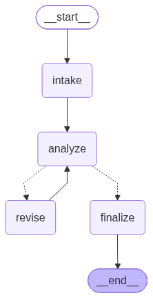

# 3. Checkpoint History

You already learned this evaluator-optimizer style of loop in `5-Workflows`.
The loop is reused here only as context for a new checkpointing skill:
inspecting the saved execution history after the graph finishes.

The graph follows this path:

```text
intake → analyze → (revise → analyze)* → finalize
```

## Graph



When the example runs, it saves this diagram both as `graph.png` in the
repository root and as `graph.png` in this tutorial folder. The folder-local
copy is the image displayed above.

## How the workflow works

1. `intake` receives the document and marks the intake step as complete.
2. `analyze` asks the LLM to evaluate the document. The LLM must return three
   structured values: a quality score from 1 to 10, a list of specific issues,
   and a recommendation to approve, revise, or reject the document.
3. The router reads the score and chooses the next node:
   - A score of 8 or higher sends the document to `finalize`.
   - A score below 8 sends it to `revise`.
4. `revise` asks the LLM to rewrite the document using the issues found during
   analysis. The revised document then returns to `analyze` for another score.
5. This analyze–revise loop can run at most `MAX_ITERATIONS` times. In this
   example the limit is 3 analysis passes, which guarantees that the graph
   cannot loop forever if the score remains below 8.

The checkpointer saves a complete copy of the graph state after every node.
That means you can inspect the document, score, issues, current stage, and next
node at each point in the run. After the workflow finishes,
`get_state_history()` retrieves those saved snapshots and the script prints
them from newest to oldest. This history lets you see exactly how the document
and routing decisions changed during every pass through the loop.

## Run

Add `OPENAI_API_KEY` to the repository-root `.env`, then run from the
repository root:

```bash
python "7-Checkpointing/03-checkpoint-history/00_document_review_loop.py"
```

## Sample checkpoint-history output

The exact scores, issues, checkpoint IDs, and number of revision passes can
change because they come from the LLM. One real run produced the following
abbreviated history:

```text
Full State History
--------------------------------------------------
Total Checkpoints: 9

Checkpoint Timeline (newest to oldest)
==================================================

Checkpoint Snapshot 9
Thread ID: doc_review_001
Checkpoint ID: 1f1a3b02-073c-619a-8007-ceb79a635e3f
Next Nodes -> None (workflow complete)
State Values:
  Stage: finalized
  Quality Score: 9
  Approved: True

Checkpoint Snapshot 8
Next Nodes -> ('finalize',)
State Values:
  Stage: analysis_complete
  Quality Score: 9
  Approved: True

Checkpoint Snapshot 7
Next Nodes -> ('analyze',)
State Values:
  Stage: revision_complete
  Quality Score: 6
  Approved: False

Checkpoint Snapshot 6
Next Nodes -> ('revise',)
State Values:
  Stage: analysis_complete
  Quality Score: 6
  Approved: False

Checkpoint Snapshot 5
Next Nodes -> ('analyze',)
State Values:
  Stage: revision_complete
  Quality Score: 4
  Approved: False

Checkpoint Snapshot 4
Next Nodes -> ('revise',)
State Values:
  Stage: analysis_complete
  Quality Score: 4
  Approved: False

Checkpoint Snapshot 3
Next Nodes -> ('analyze',)
State Values:
  Stage: intake_complete
  Quality Score: 0
  Approved: False

Checkpoint Snapshot 2
Next Nodes -> ('intake',)
State Values:
  Stage:
  Quality Score: 0
  Approved: False

Checkpoint Snapshot 1
Next Nodes -> ('__start__',)
State Values:
  Stage: N/A
  Quality Score: 0
  Approved: False
```

Read the output from the bottom upward to follow execution in chronological
order. Snapshot 1 is the graph's initial empty state. Snapshot 2 contains the
input and points to `intake`. Later snapshots show the document moving through
`intake`, `analyze`, and `revise`. The score improves from 4 to 6 to 9, so the
last analysis routes to `finalize` instead of another revision. Snapshot 9 has
no next node because the workflow has reached `END`.

There are nine checkpoints even though the graph has only four named nodes.
LangGraph also checkpoints graph initialization and input setup, and it creates
new checkpoints each time a node in the analyze–revise loop runs again. The
complete script output also includes `Issues Found`; they are omitted above
only to keep the example short.

## Key lesson

Checkpointing is not only conversational memory. It can make a looping
workflow inspectable by recording how its state and routing decisions changed
over time.
