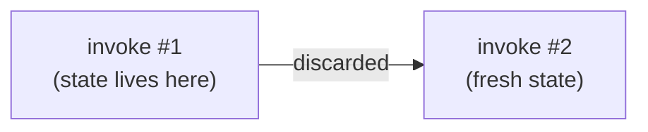
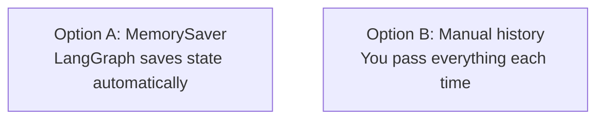

# 7. Checkpointing

This tutorial shows how LangGraph remembers (or forgets) state across multiple `invoke` calls — from simple reducer state, to chatbot memory, to failure recovery.

## Prerequisites

- Complete [6. Agents](../6-Agents/README.md) first
- **OpenAI API key required** for Examples 2–5: create a `.env` file in the repo root with `OPENAI_API_KEY=your_key_here`
- You should know: state, nodes, edges, `add_messages`

## What You'll Learn

After this tutorial, you will be able to:

- Understand what a checkpointer actually stores, using reducers and `get_state`
- Understand why a graph forgets by default between runs
- Use `MemorySaver` and `thread_id` to persist state across runs automatically
- Pass the full conversation history manually so the LLM remembers without a checkpointer
- Read a full checkpoint history (`get_state_history`) through a real analyze/revise loop, and cap that loop with a `MAX_ITERATIONS` guard

## Part 1 — Core Tutorial

By default, every `graph.invoke(...)` call starts with a blank state. The graph processes the input, returns a result, and then discards everything.



To make the graph remember, you have two options:

**Option A — Checkpointer**: LangGraph saves the state for you after each run and restores it on the next run, linked by a `thread_id`.

**Option B — Manual history**: You carry the conversation yourself by passing all previous messages on every invoke call.



### Why Checkpointers Matter

This tutorial focuses on memory, but the same checkpointer mechanism unlocks other features you'll see later:

| Feature | What the checkpointer enables |
|---|---|
| **Memory** | Follow-up messages sent to the same `thread_id` retain earlier conversation state (what this tutorial covers) |
| **Human-in-the-loop** | A person can inspect, interrupt, and approve a run, then resume it — the checkpointer is what lets execution pick back up |
| **Time travel** | You can replay or fork a graph from any earlier checkpoint to debug a step or try an alternate path |
| **Fault-tolerance** | If a node fails mid-run, LangGraph can resume from the last successful super-step instead of starting over — successful sibling nodes aren't re-run |

### Threads and Checkpoints

- **Thread** — the `thread_id` you pass in `config["configurable"]` is the primary key the checkpointer uses to store and load state. Same thread = same accumulated state across runs. Without a `thread_id`, the checkpointer has nothing to save to or restore from.
- **Checkpoint** — a snapshot of graph state saved after each super-step (one full round of node execution), represented internally as a `StateSnapshot`. `graph.get_state(config)` — used in Example 1 — returns the latest one for a thread.

### The Three Pieces of Checkpointing

| Piece | What it does |
|---|---|
| `MemorySaver()` / `InMemorySaver()` | In-memory store that saves graph state after each run |
| `compile(checkpointer=...)` | Tells the graph to use that store |
| `config = {"configurable": {"thread_id": "..."}}` | Links runs together — same thread = same memory |

## Part 2 — Code Examples

### Example 1 — Custom state with a reducer (`01_custom_state_reducer.py`)

Start here — no LLM involved, so it isolates what the checkpointer actually stores. `foo` has no reducer, so each run overwrites it. `bar` uses the `add` reducer, so values accumulate across nodes instead of being replaced. `graph.get_state(config)` shows exactly what's saved for the thread.

```python
class State(TypedDict):
    foo: str
    bar: Annotated[list[str], add]  # reducer: appends instead of overwriting

checkpointer = InMemorySaver()
graph = workflow.compile(checkpointer=checkpointer)
config = {"configurable": {"thread_id": "1"}}

first_result = graph.invoke({"foo": "", "bar": []}, config)
print(first_result)
# → {'foo': 'b', 'bar': ['a', 'b']}

print(graph.get_state(config).values)
# → {'foo': 'b', 'bar': ['a', 'b']}

second_result = graph.invoke({"foo": "", "bar": []}, config)
print(second_result)
# → {'foo': 'b', 'bar': ['a', 'b', 'a', 'b']}
```

The second run uses the same `thread_id`, so the checkpointer restores the previous state before the graph runs again. `foo` is still overwritten by the latest node, but `bar` keeps growing because it has a reducer.

The script also calls `graph.get_state_history(config)`, which returns one checkpoint per super-step — not just the final one. For a two-node graph that's `__start__` → after `node_a` → after `node_b`:

```
checkpoint 0 (next=('__start__',)): {'bar': []}
checkpoint 1 (next=('node_a',)): {'foo': '', 'bar': []}
checkpoint 2 (next=('node_b',)): {'foo': 'a', 'bar': ['a']}
checkpoint 3 (next=done): {'foo': 'b', 'bar': ['a', 'b']}
```

`next` tells you which node is about to run from that checkpoint — this is the same mechanism time travel and human-in-the-loop rely on to resume a graph from any prior step.

### Example 2 — No memory (`02_no_memory.py`)

No checkpointer. Each run starts fresh. The second run has no idea what happened in the first.

```python
graph = builder.compile()  # no checkpointer

graph.invoke({"messages": [{"role": "user", "content": "Hi, my name is Walid"}]})

result = graph.invoke({"messages": [{"role": "user", "content": "What is my name?"}]})
print(result["messages"][-1].content)
# → "I don't know your name, you haven't told me."
```

### Example 3 — With checkpointer (`03_with_checkpointer.py`)

`MemorySaver` persists the state. The `thread_id` links the two runs so the graph remembers.

```python
checkpointer = MemorySaver()
graph = builder.compile(checkpointer=checkpointer)

config = {"configurable": {"thread_id": "walid-session"}}

graph.invoke({"messages": [{"role": "user", "content": "Hi, my name is Walid"}]}, config)

result = graph.invoke({"messages": [{"role": "user", "content": "What is my name?"}]}, config)
print(result["messages"][-1].content)
# → "Your name is Walid!"
```

### Example 4 — Manual history (`04_manual_history.py`)

No checkpointer. Memory works because you pass the full conversation on every run. `result["messages"]` always contains everything so far.

```python
graph = builder.compile()  # no checkpointer needed

result = graph.invoke({"messages": [{"role": "user", "content": "Hi, my name is Walid"}]})

result = graph.invoke({
    "messages": result["messages"] + [{"role": "user", "content": "What is my name?"}]
})
print(result["messages"][-1].content)
# → "Your name is Walid!"
```

### Example 5 — Checkpoint history through a real loop (`05_document_review_loop.py`)

The earlier examples show a fixed number of checkpoints. This one shows why that count is actually *variable*: a document goes through an `analyze → revise → analyze` loop until the LLM scores it 8+ **or** a `MAX_ITERATIONS` cap is hit (the same loop-guard pattern as [`ex4_evaluator_loop_guard.py`](../Exercise-Solutions/5-workflows/ex4_evaluator_loop_guard.py) — without it, a stubborn low score could loop forever). Every node run — including every pass through the loop — writes its own checkpoint, so `get_state_history` ends up with as many entries as the loop actually took.

```python
def route_after_analysis(state: DocumentState) -> Literal["revise", "finalize"]:
    if state["quality_score"] >= 8:
        return "finalize"
    if state["iterations"] >= MAX_ITERATIONS:
        return "finalize"  # avoid an infinite loop
    return "revise"
```

Running it prints the full checkpoint timeline (newest to oldest), each with its `checkpoint_id`, pending `next` node, and state snapshot — this is the same `StateSnapshot` data `get_state_history` returns in Example 1, just over a longer, branching run.

### Example 6 — Resume after a failure (`06_resume_after_failure.py`)

Example 5 only ever calls `invoke` once, so the checkpointer never gets to prove its main real-world value: surviving a crash. This example strips that down to three plain nodes (no LLM) so the fault-tolerance behavior is easy to see. `step_two` is rigged to raise an exception on its first call, simulating a flaky API or a crashed process.

```python
try:
    graph.invoke({"log": []}, config)
except RuntimeError as e:
    print(f"Graph crashed: {e}")

state = graph.get_state(config)
print(state.values["log"])  # ['step_one'] — step_one's checkpoint was already saved
print(state.next)           # ('step_two',) — this is where execution stopped

# Resume with input=None: LangGraph continues from the last checkpoint
# for this thread_id instead of starting over.
result = graph.invoke(None, config)
print(result["log"])
# → ['step_one', 'step_two', 'step_three'] — step_one never re-ran
```

`step_one` only prints `Running step_one` once across both attempts — that's the checkpointer doing real work, not just bookkeeping. Without it, resuming would mean starting the whole graph from `START` again.

## Setup

Run from the repo root:

```bash
python "7-Checkpointing/01_custom_state_reducer.py"
python "7-Checkpointing/02_no_memory.py"
python "7-Checkpointing/03_with_checkpointer.py"
python "7-Checkpointing/04_manual_history.py"
python "7-Checkpointing/05_document_review_loop.py"
python "7-Checkpointing/06_resume_after_failure.py"
```

## Key Differences

| | No checkpoint | With checkpoint | Manual history |
|---|---|---|---|
| Remembers across runs | No | Yes | Yes |
| Who carries the memory | Nobody | LangGraph | You |
| Extra setup | None | `MemorySaver` + `thread_id` | Accumulate `result["messages"]` |
| Survives script restart | No | No (MemorySaver is in-memory) | No |

To persist memory across script restarts, swap `MemorySaver` for a database-backed checkpointer like `SqliteSaver` or `PostgresSaver`.

## What You Learned

- A checkpointer stores whatever your reducers produce — plain fields get overwritten, reduced fields accumulate
- A graph forgets by default — each `invoke` starts with a blank state
- `MemorySaver` + `thread_id` lets LangGraph save and restore state automatically
- Passing the full message history manually is equally valid and requires no checkpointer
- `get_state_history` returns one checkpoint per super-step, even across a conditional loop — always guard loops like this with a `MAX_ITERATIONS` cap
- A checkpointer's real payoff is fault-tolerance: after a crash, `invoke(None, config)` resumes from the last successful node instead of re-running the whole graph

## Next Step

For production persistence across restarts, explore `SqliteSaver` from `langgraph.checkpoint.sqlite`.
