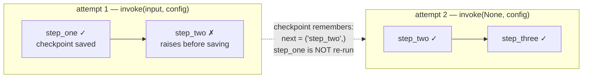
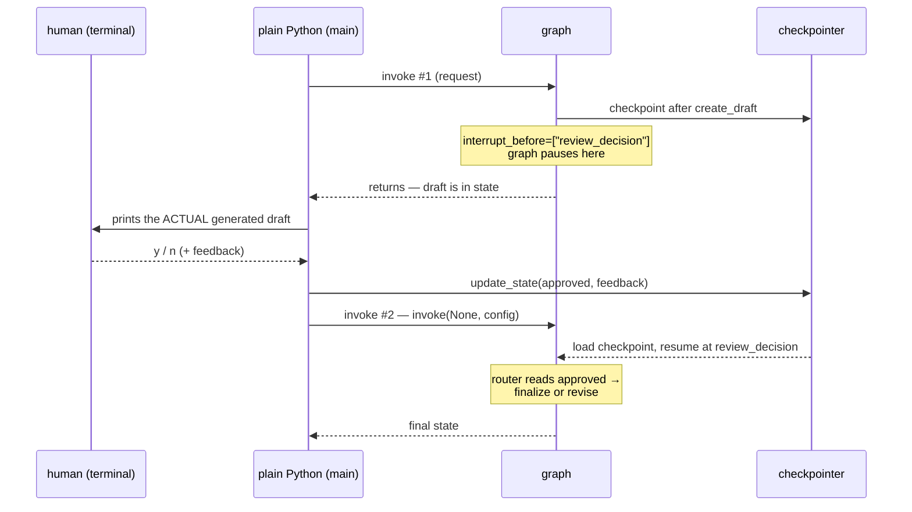

# 7. Checkpointing — Graphs That Remember

**Example files (in reading order):**

| File | Demonstrates | LLM? |
|---|---|---|
| [`01-state-snapshots/00_custom_state_reducer.py`](01-state-snapshots/00_custom_state_reducer.py) | what a checkpointer stores; snapshot history | no |
| [`02-memory-saver/00_no_memory.py`](02-memory-saver/00_no_memory.py) | the default: total amnesia between runs | yes |
| [`02-memory-saver/01_memory_saver.py`](02-memory-saver/01_memory_saver.py) | `MemorySaver` + `thread_id` = automatic memory | yes |
| [`02-memory-saver/02_manual_history.py`](02-memory-saver/02_manual_history.py) | the alternative: caller carries the history | yes |
| [`05_document_review_loop.py`](05_document_review_loop.py) | checkpoint history through a real revise loop | yes |
| [`06_resume_after_failure.py`](06_resume_after_failure.py) | crash mid-graph, resume without re-running | no |
| [`07_human_review_approval.py`](07_human_review_approval.py) | pause → human reviews → update → resume | yes |
| [`08-postgres-saver/`](08-postgres-saver/README.md) | `PostgresSaver` survives process restarts | yes |

**Requires:** `OPENAI_API_KEY` for examples 2, 3, 4, 5, 7, and 8. Example 8 also requires `DB_URI` and a running PostgreSQL database. Examples 1 and 6 are pure Python — start with those to see the mechanism without model noise.

Every graph in tutorials 1–6 had the same lifespan: `invoke()` starts with the state you pass in, and when it returns, everything is gone. This tutorial adds the missing layer — **persistence** — and shows the four things it unlocks: conversational memory, inspectable history, crash recovery, and human-in-the-loop pauses.

## The Concept: Checkpoints and Threads

**What is it?** A **checkpointer** is a storage backend attached at compile time. Once attached, LangGraph saves a **checkpoint** — a full snapshot of the state, plus which node runs next — after every super-step (every node execution). Snapshots are grouped into **threads**: the `thread_id` you pass in the config is the key under which a conversation's checkpoints accumulate.

```text
The memory lifecycle, per invoke:

invoke(input, config with thread_id)
      ↓
load latest checkpoint for that thread   ← (empty thread? start fresh)
      ↓
merge input into restored state (via the fields' reducers)
      ↓
run node → save checkpoint → run node → save checkpoint → …
      ↓
return final state (which is also the newest checkpoint)
```

**What problem does it solve?** Three at once:
1. **Memory** — a second `invoke` on the same thread starts from where the first ended, so a chatbot remembers earlier turns without the caller shipping history around.
2. **Fault-tolerance** — the graph's progress is durable per node, so a crash at node 5 doesn't cost you nodes 1–4.
3. **Interruptibility** — because "current position + state" is saved externally, execution can *stop on purpose*, let a human look and edit, and continue later.

**When is it appropriate?** Multi-turn anything, long-running pipelines with flaky steps, and any flow needing approval gates. **When is it overkill?** One-shot stateless transformations — a checkpointer there is pure overhead. And note the examples use in-memory savers (`MemorySaver` / `InMemorySaver`): memory survives *between invokes in one process*, not across script restarts. Production persistence means a database-backed saver (`SqliteSaver`, `PostgresSaver`) — same API, durable storage.

**Intuition:** a checkpointer is autosave in a video game. Each node completed writes a save slot; the `thread_id` is the save file's name. Quit and reload (crash recovery), keep playing tomorrow (memory), or hand the controller to a friend mid-level and let them change the loadout before continuing (human-in-the-loop).

## The Three Pieces

```python
checkpointer = MemorySaver()                              # 1. a store
graph = builder.compile(checkpointer=checkpointer)        # 2. attached at compile
config = {"configurable": {"thread_id": "walid-session"}} # 3. a thread key per invoke
graph.invoke(input, config)
```

All three are required. Forget the `thread_id` and the checkpointer has nowhere to file the snapshots; two invokes with *different* thread_ids are two independent conversations — that isolation is a feature (one saver, many users).

A database-backed checkpointer like `PostgresSaver` can store many thread_ids in PostgreSQL, but it still treats each one as a separate saved thread. It is durable because it survives restarts; it is not "long-term memory" by itself because it does not automatically share facts across those threads.

## Walkthrough 1 — What Actually Gets Stored (`01-state-snapshots/00_custom_state_reducer.py`)

Two plain nodes, no LLM. The state deliberately mixes both update semantics from tutorial 2:

```python
class State(TypedDict):
    foo: str                            # no reducer → overwritten
    bar: Annotated[list[str], add]      # reducer → accumulates
```

Invoke the same thread twice with `{"foo": "", "bar": []}` and:

```text
after invoke #1:  {'foo': 'b', 'bar': ['a', 'b']}
after invoke #2:  {'foo': 'b', 'bar': ['a', 'b', 'a', 'b']}
```

This is the subtlest point in the whole tutorial: **on a resumed thread, your `invoke` input is merged into the restored state through the reducers** — it does not reset the thread. `bar` doubles because the restored `['a', 'b']` keeps accumulating; `foo` looks the same only because it's overwritten anyway. Checkpointing and reducers are one system, not two.

The script also prints `get_state_history(config)` — one `StateSnapshot` per super-step, each recording the values *and* what was about to run:

```text
checkpoint 0 (next=('__start__',)): {'bar': []}
checkpoint 1 (next=('node_a',)):    {'foo': '', 'bar': []}
checkpoint 2 (next=('node_b',)):    {'foo': 'a', 'bar': ['a']}
checkpoint 3 (next=done):           {'foo': 'b', 'bar': ['a', 'b']}
```

That `next` field is the hinge for everything later in this tutorial: resuming, time travel, and human-in-the-loop all mean "load a snapshot and continue from its `next`." ("**Time travel**" is the ecosystem's name for the extra trick history enables: since every snapshot carries its own `checkpoint_id`, you can invoke with a config pointing at an *older* checkpoint and re-run — or fork — the graph from that earlier point instead of the latest one. Handy for debugging a bad step without replaying the whole run.)

## Walkthrough 2 — Memory: Without, With, and Manual (examples 02 / 03 / 04)

Three scripts, one identical chat graph (`START → chat → END`), three memory strategies:

**02 — no checkpointer.** Run 1: "Hi, my name is Walid." Run 2: "What is my name?" → *"I don't know your name."* Each `invoke` starts blank. This is the baseline that motivates everything else.

**03 — checkpointer.** Same code plus the three pieces. Run 2 on thread `"walid-session"` → *"Your name is Walid!"* The caller passed only the new message; LangGraph restored the old turn from the checkpoint and `add_messages` appended the new one.

**04 — manual history.** No checkpointer — instead the *caller* threads the transcript forward:

```python
result = graph.invoke({"messages": result["messages"] + [new_user_turn]})
```

Also works. This is exactly what tutorial 6's Exercise 3 had you do, and it's a legitimate pattern — the point of comparing them side by side:

| | No memory (02) | Checkpointer (03) | Manual history (04) |
|---|---|---|---|
| Remembers across invokes | no | yes | yes |
| Who owns the transcript | nobody | LangGraph, keyed by thread | your calling code |
| Caller passes per turn | new message | new message + `thread_id` | *entire* history + new message |
| Multiple concurrent users | n/a | trivial (one thread each) | you build the bookkeeping |
| Also gets crash-resume & pauses | no | **yes** | no |

Manual history covers *memory only*. The checkpointer's real dividend is everything below.

## Walkthrough 3 — History Through a Real Loop (`05_document_review_loop.py`)

A realistic pipeline: `intake → analyze → (revise → analyze)* → finalize`. An LLM scores a deliberately weak Q4 report via structured output (`score`, `issues`, `recommendation`); the router loops through revision until the score reaches 8 **or** an iteration cap fires:

```python
def route_after_analysis(state) -> Literal["revise", "finalize"]:
    if state["quality_score"] >= 8:      return "finalize"
    if state["iterations"] >= MAX_ITERATIONS: return "finalize"  # never loop forever
    return "revise"
```

(The same loop-guard discipline as tutorial 5's evaluator-optimizer — note `iterations` is incremented *inside* `analyze_quality`, so the evidence for the cap lives in state like every other routing signal.)

What checkpointing adds here: the loop runs a *variable* number of times, and `get_state_history` captures **every** pass — each analyze, each revise, with its score and pending `next` node. The script prints the whole timeline, newest first. Nothing in this graph *needs* a checkpointer to produce its output; it needs one to let you *reconstruct how the output happened*. That audit trail is a production feature in its own right.

## Walkthrough 4 — Crash and Resume (`06_resume_after_failure.py`)

Three plain nodes; `step_two` is rigged to raise on its first call (a stand-in for a flaky API). The choreography:

```text
Attempt 1: step_one runs → checkpoint saved → step_two raises → invoke() throws
           get_state(config).values["log"] == ['step_one']
           get_state(config).next          == ('step_two',)   ← frozen at the failure point

Attempt 2: graph.invoke(None, config)
           step_two runs (succeeds now) → step_three runs
           final log: ['step_one', 'step_two', 'step_three']  ← step_one ran exactly ONCE
```



Two things to internalize:

- **`invoke(None, config)` is the resume idiom.** `None` means "no fresh input — don't start from START"; the `thread_id` identifies which saved position to continue from. LangGraph reads the checkpoint's `next` and picks up there.
- **Completed work is never repeated.** If `step_one` charged a credit card or sent an email, resuming doesn't do it twice. Without a checkpointer, your only option after the crash is re-running the whole graph — side effects included.

## Walkthrough 5 — Human-in-the-Loop (`07_human_review_approval.py`)

The capstone: an LLM drafts a response, a *human* approves or rejects it, and the graph routes accordingly. The pause-inspect-modify-resume cycle:

```text
invoke #1        → create_draft runs → graph pauses (checkpoint saved)
   ⏸ paused      → terminal shows the REAL draft; user types y/n (+ feedback)
update_state()   → decision written into the saved checkpoint
invoke #2 (None) → review_decision reads the decision → finalize or revise → END
```

The mechanics, in code:

```python
graph = builder.compile(checkpointer=checkpointer,
                        interrupt_before=["review_decision"])   # planned pause

result = graph.invoke(initial_input, config)      # runs create_draft, then freezes
decision = ask_for_review_decision(result["draft"])  # ordinary Python, graph not running
graph.update_state(config, decision)              # edit the checkpoint in place
final_state = graph.invoke(None, config)          # resume: review_decision → route
```

The full choreography as a sequence — notice the graph is *not running* while the human decides:



Design points that make this example worth studying closely:

- **The human is *outside* the graph.** `review_decision` doesn't call `input()` — it just reads `approved`/`feedback` from state. The blocking, UI-specific part lives between the two invokes, in ordinary code. Swap the terminal prompt for a Slack button or web form and the graph is untouched.
- **Why interrupt at all?** Because the human's decision depends on output that doesn't exist until mid-run. You can't collect approval of a draft before the draft is generated. `interrupt_before` is a *planned* stop at exactly that point — same machinery as example 6's *unplanned* stop, deliberate this time.
- **`update_state` is the third state-writing mechanism** you've now seen: nodes write during execution, reducers merge, and `update_state` edits a saved checkpoint from outside while nothing is running.

## Running the Examples

From the repo root, in order:

```bash
python "7-Checkpointing/01-state-snapshots/00_custom_state_reducer.py"
python "7-Checkpointing/02-memory-saver/00_no_memory.py"
python "7-Checkpointing/02-memory-saver/01_memory_saver.py"
python "7-Checkpointing/02-memory-saver/02_manual_history.py"
python "7-Checkpointing/05_document_review_loop.py"
python "7-Checkpointing/06_resume_after_failure.py"
python "7-Checkpointing/07_human_review_approval.py"   # interactive — it will prompt you
python "7-Checkpointing/08-postgres-saver/00_setup_tables.py"      # run once to create/validate tables
python "7-Checkpointing/08-postgres-saver/01_save_name.py"         # save first turn, then process exits
python "7-Checkpointing/08-postgres-saver/02_recall_name.py"       # new process recalls from PostgreSQL
```

## Design Questions Worth Asking

- **What happens if you pass real input (not `None`) when resuming a thread?** It's merged into the restored state through the reducers — that's example 1's doubling `bar`. Resume-in-place is `None`; "continue the conversation with a new turn" is real input. Know which one you mean.
- **Why does the checkpoint save after every node rather than every invoke?** Per-node granularity is what makes mid-run recovery (example 6) and mid-run pauses (example 7) possible at the exact step needed. Per-invoke saves could only replay whole runs.
- **When would you still choose manual history over a checkpointer?** When the surrounding application already owns conversation storage (e.g., history lives in your database and is passed per request), or you want zero framework state. You give up resume and interrupts.
- **What's the production gap in these examples?** `MemorySaver` dies with the process. The graph code doesn't change — swap in `SqliteSaver`/`PostgresSaver` and threads survive restarts and can be shared across workers.
- **Is the checkpointer where *all* memory belongs?** No — and confusing the two scopes is a classic architecture mistake. A checkpointer is **thread-scoped**: everything it saves lives and dies with one `thread_id`. Store a fact there ("the user prefers concise answers") and it evaporates the moment the same user opens a new conversation thread. Cross-thread, long-lived facts belong in LangGraph's separate **`Store`** interface (e.g. `InMemoryStore`, passed to `compile(checkpointer=..., store=...)`), which namespaces data by keys like a user ID rather than by thread. Rule of thumb: checkpointer = *this conversation's* short-term memory; store = *this user's* long-term memory. This tutorial covers only the first; know the second exists before you architect around threads.

## Key Takeaways

1. Persistence = **checkpointer at compile + `thread_id` at invoke**. Snapshots save after every node; threads keep users' histories isolated.
2. On a resumed thread, input merges into restored state **through the reducers** — checkpointing and tutorial 2 are one system.
3. `invoke(None, config)` resumes from the saved position without re-running completed nodes — that's crash recovery, and side effects don't repeat.
4. Human-in-the-loop is checkpointing plus a *planned* interrupt: pause before the decision node, let ordinary code collect the human's verdict, `update_state`, resume. The graph never blocks on a human.
5. In-memory savers teach the API; production durability is a one-line swap to a database-backed saver.

## Where to Go Next

You've now covered the full arc: state → reducers → messages → branching → workflow patterns → agents → persistence. Two natural continuations: work through the [`Exercise-Solutions/`](../Exercise-Solutions/) folders you haven't attempted, and read [`08-postgres-saver/README.md`](08-postgres-saver/README.md) to see how the in-memory examples map to production-style PostgreSQL checkpointing.
