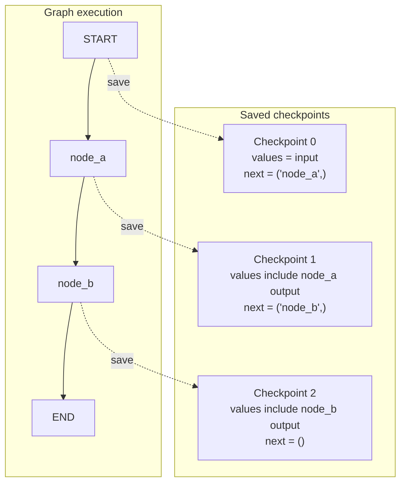
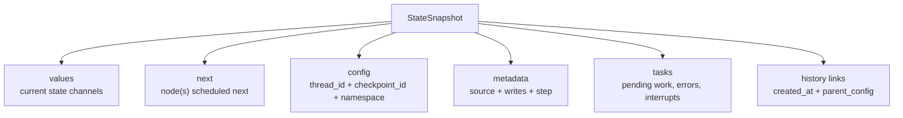
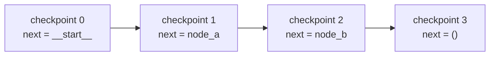
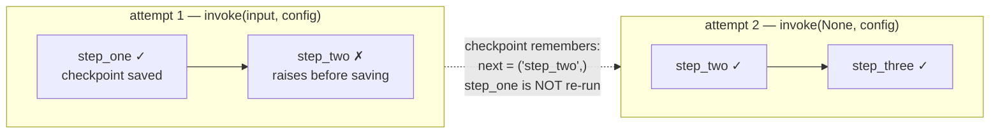
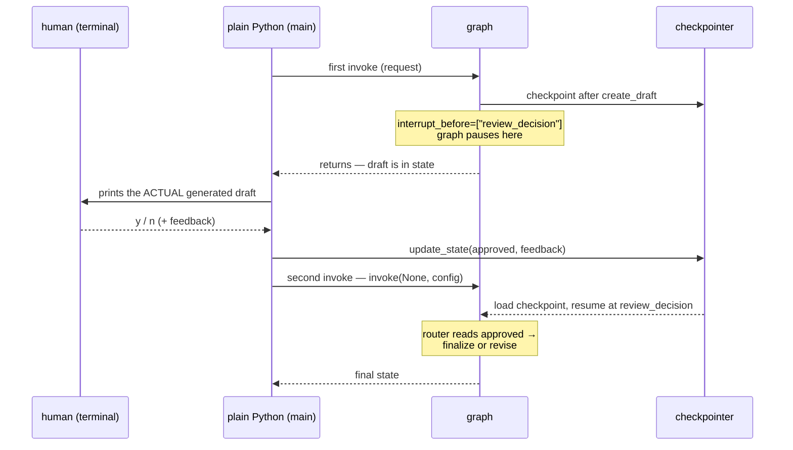

# 7. Checkpointing — Graphs That Remember

LangGraph state normally lives for one `invoke()` call. A checkpointer turns
that temporary state into a sequence of saved snapshots. Those snapshots let a
graph remember a conversation, show how it reached an answer, pause for human
review, or resume after a failure.

By the end of this tutorial, you will be able to:

- explain the difference between a reducer and a checkpointer;
- use `thread_id` to continue or isolate conversations;
- inspect a snapshot's saved `values` and `next` nodes;
- choose between `MemorySaver`, SQLite, and PostgreSQL;
- resume interrupted work without restarting the whole graph.

**Example files (in reading order):**

| File | Demonstrates | LLM? |
|---|---|---|
| [`01-state-snapshots/00_custom_state_reducer.py`](01-state-snapshots/00_custom_state_reducer.py) | what a checkpointer stores; snapshot history | no |
| [`02-memory-saver/00_no_memory.py`](02-memory-saver/00_no_memory.py) | the default: total amnesia between runs | yes |
| [`02-memory-saver/01_memory_saver.py`](02-memory-saver/01_memory_saver.py) | `MemorySaver` + `thread_id` = automatic memory | yes |
| [`02-memory-saver/02_manual_history.py`](02-memory-saver/02_manual_history.py) | the alternative: caller carries the history | yes |
| [`05_document_review_loop.py`](05_document_review_loop.py) | checkpoint history through a real revise loop | yes |
| [`06_resume_after_failure.py`](06_resume_after_failure.py) | crash mid-graph, resume without re-running | no |
| [`07_human_review_approval.py`](07_human_review_approval.py) | pause → human reviews → update → resume | yes |
| [`08-postgres-saver/`](08-postgres-saver/README.md) | `PostgresSaver` survives process restarts | yes |

**Requires:** `OPENAI_API_KEY` for examples 2, 3, 4, 5, 7, and 8. Example 8 also requires `DB_URI` and a running PostgreSQL database. Examples 1 and 6 are pure Python — start with those to see the mechanism without model noise.

Every graph in tutorials 1–6 had the same lifespan: `invoke()` starts with the state you pass in, and when it returns, everything is gone. This tutorial adds the missing layer — **persistence** — and shows the four things it unlocks: conversational memory, inspectable history, crash recovery, and human-in-the-loop pauses.

## Start Here

Run all commands from the repository root.

```bash
python -m venv .venv
source .venv/bin/activate
python -m pip install -r requirements.txt
```

For examples that call an LLM, create a `.env` file in the repository root:

```text
OPENAI_API_KEY=your_key_here
```

If a script does not load `.env` itself, export the key in the shell before
running it:

```bash
export OPENAI_API_KEY="your_key_here"
```

Begin with these two free, deterministic examples:

```bash
python "7-Checkpointing/01-state-snapshots/00_custom_state_reducer.py"
python "7-Checkpointing/06_resume_after_failure.py"
```

Then compare the three chat examples in this order:

```bash
python "7-Checkpointing/02-memory-saver/00_no_memory.py"
python "7-Checkpointing/02-memory-saver/01_memory_saver.py"
python "7-Checkpointing/02-memory-saver/02_manual_history.py"
```

Keep this mental model nearby:

> **One `thread_id` = one continuous conversation or workflow.** Reusing it
> restores and extends that saved state. A different `thread_id` starts a
> brand-new, isolated thread.

## Why Is Memory Per Thread?

Because a checkpointer remembers **the state of one ongoing interaction**, not
everything an agent has ever learned.

First, separate the concept from its implementations:

```text
checkpointing                         ← the persistence capability
└── BaseCheckpointSaver               ← the common saver interface
    ├── InMemorySaver / MemorySaver    ← stores checkpoints in RAM
    ├── SqliteSaver                    ← stores checkpoints in SQLite
    └── PostgresSaver                  ← stores checkpoints in PostgreSQL
```

These are not different kinds of memory scope. They all save the same kind of
thread-scoped graph state and are all supplied through
`compile(checkpointer=...)`. They differ primarily in storage, durability,
concurrency, and intended deployment:

| Implementation | Backing storage | Survives restart? | Best fit |
|---|---|---:|---|
| `InMemorySaver` / `MemorySaver` | process RAM | no | learning and tests |
| `SqliteSaver` | local SQLite database | yes | demos and small local workflows |
| `PostgresSaver` | PostgreSQL | yes | production and multiple workers |

> **Does stopping Python erase the checkpoints?**
>
> - With `InMemorySaver`, **yes**. Its checkpoints exist only in that Python
>   process's RAM.
> - With `SqliteSaver`, **no**, provided it uses a file-backed SQLite database.
>   A new Python process can reopen the same file and load the same thread.
> - With `PostgresSaver`, **no**. A new process can reconnect to the same
>   PostgreSQL database and load the same thread.
>
> The exceptions are temporary storage or deliberate deletion. For example,
> SQLite `":memory:"` is RAM-backed and disappears with the process. Deleting
> the SQLite file, dropping PostgreSQL tables, or deleting a thread also removes
> its checkpoints.

The naming can be confusing: `MemorySaver` does not represent a separate
checkpointing system—it is the in-memory saver implementation. Replacing it
with `SqliteSaver` or `PostgresSaver` changes where checkpoints live, not how
`thread_id` scopes them.

A `thread_id` is simply the lookup key for a saved session or workflow:

```text
thread "customer-42/support-7"  → messages, tool results, current node
thread "customer-42/support-8"  → a separate support case
thread "customer-99/support-1"  → another customer's isolated state
```

This scope is useful for the same reason separate browser tabs are useful. You
want each conversation or job to resume where it stopped, but you do **not**
want unrelated conversations accidentally sharing private messages,
intermediate tool results, approvals, or workflow position.

Thread-scoped checkpoints solve questions such as:

- What did the user already say **in this conversation**?
- Which nodes and tool calls have completed **in this run**?
- Where should the graph resume after a crash or approval pause?
- Which draft or intermediate result belongs to **this job**?

The thread can last for minutes, months, or many process restarts. “Per thread”
describes isolation, not how long the data lives. Whether it survives a restart
depends on which saver implementation you choose. To resume after restarting,
reconnect to the same database and invoke the graph with the same `thread_id`.

What if information should follow a user into a **new** thread? That is
long-term, cross-thread memory and belongs in a LangGraph `Store`, normally
namespaced by user or organization:

```text
checkpointer + thread_id → “Where is this conversation/workflow?”
store + user_id          → “What should future conversations know?”
```

For example, the current support conversation belongs in its checkpoint.
The durable preference “Walid likes concise answers” belongs in a Store. Most
production agents use both.

## The Concept: Checkpoints and Threads

**What is it?** A **checkpointer** is a storage backend attached at compile
time. Once attached, LangGraph saves a **checkpoint** at every super-step
boundary. Each checkpoint contains a `StateSnapshot`: the graph's values,
execution metadata, and—critically—the node or nodes to execute `next`.
Snapshots are grouped into **threads** using the configured `thread_id`.

For a sequential graph, each node runs in its own super-step, so you can picture
one new checkpoint after each node:


```mermaid
flowchart TB
    subgraph execution["Graph execution"]
        direction LR
        S["START"] --> A["node_a"] --> B["node_b"] --> E["END"]
    end
    subgraph snapshots["Saved checkpoints"]
        direction LR
        C0["Checkpoint 0<br/>values = input<br/>next = ('node_a',)"]
        C1["Checkpoint 1<br/>values include node_a output<br/>next = ('node_b',)"]
        C2["Checkpoint 2<br/>values include node_b output<br/>next = ()"]
        C0 ~~~ C1 ~~~ C2
    end
    S -. "save" .-> C0
    A -. "save" .-> C1
    B -. "save" .-> C2
```

Read the diagram vertically as well as horizontally:

- The top row is graph execution.
- The checkpoint under a step is the durable snapshot produced at that
  super-step boundary.
- The snapshot's `values` say **what the state is now**.
- The snapshot's `next` says **where execution continues**.

That last field is easy to overlook. A checkpoint does not merely remember the
conversation data; it also remembers the graph's position. If execution stops
after `node_a`, LangGraph reloads Checkpoint 1, sees `next=('node_b',)`, and
continues at `node_b` instead of starting over.

> **Sequential versus parallel graphs:** “one checkpoint after every node” is
> accurate for a linear graph because each node occupies its own super-step. If
> several nodes run in parallel during the same super-step, their writes belong
> to one full checkpoint when that super-step completes. LangGraph also records
> successful per-node pending writes so completed parallel work need not be
> repeated if a sibling node fails.

```text
The memory lifecycle, per invoke:

invoke(input, config with thread_id)
      ↓
load latest checkpoint for that thread   ← (empty thread? start fresh)
      ↓
merge input into restored state (via the fields' reducers)
      ↓
run node → save checkpoint → run node → save checkpoint → …
      ↓
return final state (which is also the newest checkpoint)
```

### What Is Inside a `StateSnapshot`?


```mermaid
flowchart TB
    SS["StateSnapshot"]
    SS --> V["values<br/>current state channels"]
    SS --> N["next<br/>node(s) scheduled next"]
    SS --> C["config<br/>thread_id + checkpoint_id + namespace"]
    SS --> M["metadata<br/>source + writes + step"]
    SS --> T["tasks<br/>pending work, errors, interrupts"]
    SS --> H["history links<br/>created_at + parent_config"]
```

| Field | What it answers |
|---|---|
| `values` | What data does the graph currently know? |
| `next` | Which node or nodes execute next? Empty `()` means the graph is finished. |
| `config` | Which thread, checkpoint, and checkpoint namespace identify this snapshot? |
| `metadata` | Which step created it, what wrote to it, and was it input, loop execution, or an external update? |
| `tasks` | What work is scheduled, interrupted, or failed at this point? |
| `created_at` | When was the checkpoint created? |
| `parent_config` | Which earlier checkpoint is its parent? |

A simplified snapshot after `node_a` might look like:

```python
StateSnapshot(
    values={"foo": "a", "bar": ["a"]},
    next=("node_b",),  # saved position: resume at node_b
    config={
        "configurable": {
            "thread_id": "walid-session",
            "checkpoint_ns": "",
            "checkpoint_id": "..."
        }
    },
    metadata={
        "source": "loop",
        "writes": {"node_a": {"foo": "a", "bar": ["a"]}},
        "step": 1
    },
    created_at="...",
    parent_config={...},
    tasks=(...)
)
```

**What problem does it solve?** Three at once:

1. **Memory** — a second `invoke` on the same thread starts from where the first ended, so a chatbot remembers earlier turns without the caller shipping history around.
2. **Fault-tolerance** — the graph's progress is durable per node, so a crash at node 5 doesn't cost you nodes 1–4.
3. **Interruptibility** — because "current position + state" is saved externally, execution can *stop on purpose*, let a human look and edit, and continue later.

**When is it appropriate?** Multi-turn anything, long-running pipelines with flaky steps, and any flow needing approval gates. **When is it overkill?** One-shot stateless transformations — a checkpointer there is pure overhead. And note the examples use in-memory savers (`MemorySaver` / `InMemorySaver`): memory survives *between invokes in one process*, not across script restarts. Production persistence means a database-backed saver (`SqliteSaver`, `PostgresSaver`) — same API, durable storage.

**Intuition:** a checkpointer is autosave in a video game. Each node completed writes a save slot; the `thread_id` is the save file's name. Quit and reload (crash recovery), keep playing tomorrow (memory), or hand the controller to a friend mid-level and let them change the loadout before continuing (human-in-the-loop).

## The Three Pieces

```python
checkpointer = MemorySaver()                              # 1. a store
graph = builder.compile(checkpointer=checkpointer)        # 2. attached at compile
config = {"configurable": {"thread_id": "walid-session"}} # 3. a thread key per invoke
graph.invoke(input, config)
```

All three are required. Forget the `thread_id` and the checkpointer has nowhere
to file the snapshots. Reuse the same `thread_id` to continue the same
conversation or workflow; choose a new one to start isolated state:

```python
walid = {"configurable": {"thread_id": "walid/support-7"}}
sara = {"configurable": {"thread_id": "sara/support-1"}}

graph.invoke({"messages": [("user", "My order is late")]}, walid)
graph.invoke({"messages": [("user", "What did I just report?")]}, walid)  # remembers
graph.invoke({"messages": [("user", "What did Walid report?")]}, sara)    # isolated
```

A database-backed checkpointer like `PostgresSaver` can store many thread_ids in PostgreSQL, but it still treats each one as a separate saved thread. It is durable because it survives restarts; it is not "long-term memory" by itself because it does not automatically share facts across those threads.

## Walkthrough 1 — What Actually Gets Stored (`01-state-snapshots/00_custom_state_reducer.py`)

Two plain nodes, no LLM. The state deliberately mixes both update semantics from tutorial 2:

```python
class State(TypedDict):
    foo: str                            # no reducer → overwritten
    bar: Annotated[list[str], add]      # reducer → accumulates
```

Invoke the same thread twice with `{"foo": "", "bar": []}` and:

```text
after invoke #1:  {'foo': 'b', 'bar': ['a', 'b']}
after invoke #2:  {'foo': 'b', 'bar': ['a', 'b', 'a', 'b']}
```

This is the subtlest point in the whole tutorial: **on a resumed thread, your `invoke` input is merged into the restored state through the reducers** — it does not reset the thread. `bar` doubles because the restored `['a', 'b']` keeps accumulating; `foo` looks the same only because it's overwritten anyway. Checkpointing and reducers are one system, not two.

The script also prints `get_state_history(config)`—one `StateSnapshot` per
super-step, each recording both the values and what is scheduled to run next:

```text
checkpoint 0 (next=('__start__',)): {'bar': []}
checkpoint 1 (next=('node_a',)):    {'foo': '', 'bar': []}
checkpoint 2 (next=('node_b',)):    {'foo': 'a', 'bar': ['a']}
checkpoint 3 (next=done):           {'foo': 'b', 'bar': ['a', 'b']}
```

The snapshots tell a complete execution story:


```mermaid
flowchart LR
    C0["checkpoint 0<br/>next = __start__"]
    C1["checkpoint 1<br/>next = node_a"]
    C2["checkpoint 2<br/>next = node_b"]
    C3["checkpoint 3<br/>next = ()"]
    C0 --> C1 --> C2 --> C3
```

The `next` field is the hinge for everything later in this tutorial: resuming,
time travel, and human-in-the-loop all mean “load a snapshot and continue from
its `next`.” **Time travel** adds one more capability: because every snapshot
also carries a `checkpoint_id`, you can point at an older checkpoint and replay
or fork execution from that saved position.

## Walkthrough 2 — Memory: Without, With, and Manual

Three scripts, one identical chat graph (`START → chat → END`), three memory strategies:

**`00_no_memory.py` — no checkpointer.** Run 1: "Hi, my name is Walid."
Run 2: "What is my name?" → *"I don't know your name."* Each `invoke`
starts blank. This is the baseline that motivates everything else.

**`01_memory_saver.py` — checkpointer.** Same graph plus the three persistence
pieces. Run 2 on thread `"walid-session"` → *"Your name is Walid!"* The caller
passed only the new message; LangGraph restored the old turn from the
checkpoint and `add_messages` appended the new one.

**`02_manual_history.py` — manual history.** No checkpointer—instead the
*caller* carries the transcript forward:

```python
result = graph.invoke({"messages": result["messages"] + [new_user_turn]})
```

Also works. This is exactly what tutorial 6's Exercise 3 had you do, and it's a legitimate pattern — the point of comparing them side by side:

| | `00_no_memory.py` | `01_memory_saver.py` | `02_manual_history.py` |
|---|---|---|---|
| Remembers across invokes | no | yes | yes |
| Who owns the transcript | nobody | LangGraph, keyed by thread | your calling code |
| Caller passes per turn | new message | new message + `thread_id` | *entire* history + new message |
| Multiple concurrent users | n/a | trivial (one thread each) | you build the bookkeeping |
| Also gets crash-resume & pauses | no | **yes** | no |

Manual history covers *memory only*. The checkpointer's real dividend is everything below.

> **Production recommendation:** For a production conversational LangGraph
> application, the usual choice is a durable checkpointer such as
> `PostgresSaver`, with a separate `thread_id` for each conversation.

## Walkthrough 3 — History Through a Real Loop (`05_document_review_loop.py`)

A realistic pipeline: `intake → analyze → (revise → analyze)* → finalize`. An LLM scores a deliberately weak Q4 report via structured output (`score`, `issues`, `recommendation`); the router loops through revision until the score reaches 8 **or** an iteration cap fires:

```python
def route_after_analysis(state) -> Literal["revise", "finalize"]:
    if state["quality_score"] >= 8:      return "finalize"
    if state["iterations"] >= MAX_ITERATIONS: return "finalize"  # never loop forever
    return "revise"
```

(The same loop-guard discipline as tutorial 5's evaluator-optimizer — note `iterations` is incremented *inside* `analyze_quality`, so the evidence for the cap lives in state like every other routing signal.)

What checkpointing adds here: the loop runs a *variable* number of times, and `get_state_history` captures **every** pass — each analyze, each revise, with its score and pending `next` node. The script prints the whole timeline, newest first. Nothing in this graph *needs* a checkpointer to produce its output; it needs one to let you *reconstruct how the output happened*. That audit trail is a production feature in its own right.

## Walkthrough 4 — Crash and Resume (`06_resume_after_failure.py`)

Three plain nodes; `step_two` is rigged to raise on its first call (a stand-in for a flaky API). The choreography:

```text
Attempt 1: step_one runs → checkpoint saved → step_two raises → invoke() throws
           get_state(config).values["log"] == ['step_one']
           get_state(config).next          == ('step_two',)   ← frozen at the failure point

Attempt 2: graph.invoke(None, config)
           step_two runs (succeeds now) → step_three runs
           final log: ['step_one', 'step_two', 'step_three']  ← step_one ran exactly ONCE
```


```mermaid
flowchart LR
    subgraph A1["attempt 1 — invoke(input, config)"]
        direction LR
        P1["step_one ✓<br/>checkpoint saved"] --> P2["step_two ✗<br/>raises before saving"]
    end
    subgraph A2["attempt 2 — invoke(None, config)"]
        direction LR
        P2b["step_two ✓"] --> P3["step_three ✓"]
    end
    A1 -. "checkpoint remembers:<br/>next = ('step_two',)<br/>step_one is NOT re-run" .-> A2
```

Two things to internalize:

- **`invoke(None, config)` is the resume idiom.** `None` means "no fresh input — don't start from START"; the `thread_id` identifies which saved position to continue from. LangGraph reads the checkpoint's `next` and picks up there.
- **Successfully checkpointed steps are not re-run during this resume.** In
  the example, `step_one` completed and its checkpoint was saved, so execution
  resumes at `step_two`. A node that fails before its successful result is
  checkpointed may run again. External side effects such as charging a card
  or sending an email should still use idempotency keys because a process can
  fail after the side effect succeeds but before its checkpoint is committed.

## Walkthrough 5 — Human-in-the-Loop (`07_human_review_approval.py`)

The capstone: an LLM drafts a response, a *human* approves or rejects it, and the graph routes accordingly. The pause-inspect-modify-resume cycle:

```text
invoke #1        → create_draft runs → graph pauses (checkpoint saved)
   ⏸ paused      → terminal shows the REAL draft; user types y/n (+ feedback)
update_state()   → decision written into the saved checkpoint
invoke #2 (None) → review_decision reads the decision → finalize or revise → END
```

The mechanics, in code:

```python
graph = builder.compile(checkpointer=checkpointer,
                        interrupt_before=["review_decision"])   # planned pause

result = graph.invoke(initial_input, config)      # runs create_draft, then freezes
decision = ask_for_review_decision(result["draft"])  # ordinary Python, graph not running
graph.update_state(config, decision)              # edit the checkpoint in place
final_state = graph.invoke(None, config)          # resume: review_decision → route
```

The full choreography as a sequence — notice the graph is *not running* while the human decides:


```mermaid
sequenceDiagram
    participant H as human (terminal)
    participant P as plain Python (main)
    participant G as graph
    participant C as checkpointer
    P->>G: first invoke (request)
    G->>C: checkpoint after create_draft
    Note over G: interrupt_before=["review_decision"]<br/>graph pauses here
    G-->>P: returns — draft is in state
    P->>H: prints the ACTUAL generated draft
    H-->>P: y / n (+ feedback)
    P->>C: update_state(approved, feedback)
    P->>G: second invoke — invoke(None, config)
    C-->>G: load checkpoint, resume at review_decision
    Note over G: router reads approved →<br/>finalize or revise
    G-->>P: final state
```

Design points that make this example worth studying closely:

- **The human is *outside* the graph.** `review_decision` doesn't call `input()` — it just reads `approved`/`feedback` from state. The blocking, UI-specific part lives between the two invokes, in ordinary code. Swap the terminal prompt for a Slack button or web form and the graph is untouched.
- **Why interrupt at all?** Because the human's decision depends on output that doesn't exist until mid-run. You can't collect approval of a draft before the draft is generated. `interrupt_before` is a *planned* stop at exactly that point — same machinery as example 6's *unplanned* stop, deliberate this time.
- **`update_state` is the third state-writing mechanism** you've now seen: nodes write during execution, reducers merge, and `update_state` edits a saved checkpoint from outside while nothing is running.

## Running the Examples

From the repo root, in order:

```bash
python "7-Checkpointing/01-state-snapshots/00_custom_state_reducer.py"
python "7-Checkpointing/02-memory-saver/00_no_memory.py"
python "7-Checkpointing/02-memory-saver/01_memory_saver.py"
python "7-Checkpointing/02-memory-saver/02_manual_history.py"
python "7-Checkpointing/05_document_review_loop.py"
python "7-Checkpointing/06_resume_after_failure.py"
python "7-Checkpointing/07_human_review_approval.py"   # interactive — it will prompt you
python "7-Checkpointing/08-postgres-saver/00_setup_tables.py"      # run once to create/validate tables
python "7-Checkpointing/08-postgres-saver/01_save_name.py"         # save first turn, then process exits
python "7-Checkpointing/08-postgres-saver/02_recall_name.py"       # new process recalls from PostgreSQL
```

## Design Questions Worth Asking

- **What happens if you pass real input (not `None`) when resuming a thread?** It's merged into the restored state through the reducers — that's example 1's doubling `bar`. Resume-in-place is `None`; "continue the conversation with a new turn" is real input. Know which one you mean.
- **Why does the checkpoint save after every node rather than every invoke?** Per-node granularity is what makes mid-run recovery (example 6) and mid-run pauses (example 7) possible at the exact step needed. Per-invoke saves could only replay whole runs.
- **When would you still choose manual history over a checkpointer?** When the surrounding application already owns conversation storage (e.g., history lives in your database and is passed per request), or you want zero framework state. You give up resume and interrupts.
- **What's the production gap in these examples?** `MemorySaver` dies with the process. The graph code doesn't change — swap in `SqliteSaver`/`PostgresSaver` and threads survive restarts and can be shared across workers.
- **Is the checkpointer where *all* memory belongs?** No — and confusing the two scopes is a classic architecture mistake. A checkpointer is **thread-scoped**: everything it saves lives and dies with one `thread_id`. Store a fact there ("the user prefers concise answers") and it evaporates the moment the same user opens a new conversation thread. Cross-thread, long-lived facts belong in LangGraph's separate **`Store`** interface (e.g. `InMemoryStore`, passed to `compile(checkpointer=..., store=...)`), which namespaces data by keys like a user ID rather than by thread. Rule of thumb: checkpointer = *this conversation's* short-term memory; store = *this user's* long-term memory. This tutorial covers only the first; know the second exists before you architect around threads.

## Key Takeaways

1. Persistence = **checkpointer at compile + `thread_id` at invoke**. Full
   snapshots save at super-step boundaries—after each node in a sequential
   graph—and threads keep histories isolated.
2. On a resumed thread, input merges into restored state **through the reducers** — checkpointing and tutorial 2 are one system.
3. `invoke(None, config)` resumes from the saved position without re-running completed nodes — that's crash recovery, and side effects don't repeat.
4. Human-in-the-loop is checkpointing plus a *planned* interrupt: pause before the decision node, let ordinary code collect the human's verdict, `update_state`, resume. The graph never blocks on a human.
5. In-memory savers teach the API; production durability is a one-line swap to a database-backed saver.
6. Thread scope is intentional isolation, not short retention: use the same
   thread for an ongoing task, and use a `Store` for facts that must cross
   threads.
7. A `StateSnapshot` saves both `values` and `next`: the data tells LangGraph
   what it knows, while `next` tells it where to resume.

## Where to Go Next

You've now covered the full arc: state → reducers → messages → branching → workflow patterns → agents → persistence. Two natural continuations: work through the [`Exercise-Solutions/`](../Exercise-Solutions/) folders you haven't attempted, and read [`08-postgres-saver/README.md`](08-postgres-saver/README.md) to see how the in-memory examples map to production-style PostgreSQL checkpointing.
