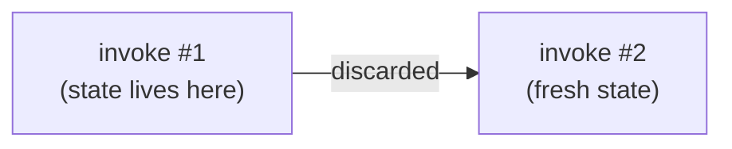
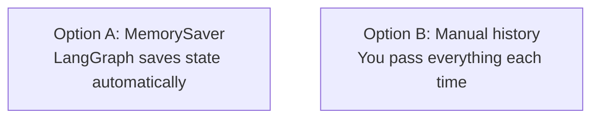

# 8. Checkpointing

This tutorial shows three ways a LangGraph chatbot can remember (or forget) conversation history across multiple `invoke` calls.

## Prerequisites

- Complete [6. Agents](../6-Agents/README.md) first
- **OpenAI API key required**: create a `.env` file in the repo root with `OPENAI_API_KEY=your_key_here`
- You should know: state, nodes, edges, `add_messages`

## What You'll Learn

After this tutorial, you will be able to:

- Understand why a graph forgets by default between runs
- Use `MemorySaver` and `thread_id` to persist state across runs automatically
- Pass the full conversation history manually so the LLM remembers without a checkpointer

## Part 1 — Core Tutorial

By default, every `graph.invoke(...)` call starts with a blank state. The graph processes the input, returns a result, and then discards everything.



To make the graph remember, you have two options:

**Option A — Checkpointer**: LangGraph saves the state for you after each run and restores it on the next run, linked by a `thread_id`.

**Option B — Manual history**: You carry the conversation yourself by passing all previous messages on every invoke call.



### The Three Pieces of Checkpointing

| Piece | What it does |
|---|---|
| `MemorySaver()` | In-memory store that saves graph state after each run |
| `compile(checkpointer=...)` | Tells the graph to use that store |
| `config = {"configurable": {"thread_id": "..."}}` | Links runs together — same thread = same memory |

## Part 2 — Code Examples

### Example 1 — No memory (`01_no_memory.py`)

No checkpointer. Each run starts fresh. The second run has no idea what happened in the first.

```python
graph = builder.compile()  # no checkpointer

graph.invoke({"messages": [{"role": "user", "content": "Hi, my name is Walid"}]})

result = graph.invoke({"messages": [{"role": "user", "content": "What is my name?"}]})
print(result["messages"][-1].content)
# → "I don't know your name, you haven't told me."
```

### Example 2 — With checkpointer (`02_with_checkpointer.py`)

`MemorySaver` persists the state. The `thread_id` links the two runs so the graph remembers.

```python
checkpointer = MemorySaver()
graph = builder.compile(checkpointer=checkpointer)

config = {"configurable": {"thread_id": "walid-session"}}

graph.invoke({"messages": [{"role": "user", "content": "Hi, my name is Walid"}]}, config)

result = graph.invoke({"messages": [{"role": "user", "content": "What is my name?"}]}, config)
print(result["messages"][-1].content)
# → "Your name is Walid!"
```

### Example 3 — Manual history (`03_manual_history.py`)

No checkpointer. Memory works because you pass the full conversation on every run. `result["messages"]` always contains everything so far.

```python
graph = builder.compile()  # no checkpointer needed

result = graph.invoke({"messages": [{"role": "user", "content": "Hi, my name is Walid"}]})

result = graph.invoke({
    "messages": result["messages"] + [{"role": "user", "content": "What is my name?"}]
})
print(result["messages"][-1].content)
# → "Your name is Walid!"
```

## Setup

Run from the repo root:

```bash
python "8-Checkpointing/01_no_memory.py"
python "8-Checkpointing/02_with_checkpointer.py"
python "8-Checkpointing/03_manual_history.py"
```

## Key Differences

| | No checkpoint | With checkpoint | Manual history |
|---|---|---|---|
| Remembers across runs | No | Yes | Yes |
| Who carries the memory | Nobody | LangGraph | You |
| Extra setup | None | `MemorySaver` + `thread_id` | Accumulate `result["messages"]` |
| Survives script restart | No | No (MemorySaver is in-memory) | No |

To persist memory across script restarts, swap `MemorySaver` for a database-backed checkpointer like `SqliteSaver` or `PostgresSaver`.

## What You Learned

- A graph forgets by default — each `invoke` starts with a blank state
- `MemorySaver` + `thread_id` lets LangGraph save and restore state automatically
- Passing the full message history manually is equally valid and requires no checkpointer

## Next Step

For production persistence across restarts, explore `SqliteSaver` from `langgraph.checkpoint.sqlite`.
