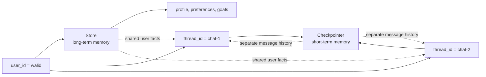

# 8. Long-Term Memory — Remembering Across Conversations

Checkpointing taught the graph to remember one conversation. Long-term memory
adds a different ability: remembering selected user or application facts across
many separate conversations.

## The Two Memory Scopes



| Memory | Scope | LangGraph component | Lookup identity |
|---|---|---|---|
| Short-term | one chat or workflow | checkpointer | `thread_id` |
| Long-term | many chats for a user or application | Store | namespace, often containing `user_id` |

Most production agents use both:

- the checkpointer remembers what happened in this conversation;
- the Store remembers what should be available in future conversations.

## Important: Long-Term Scope Is Not the Same as Durable Storage

The word **long-term** means the memory can be shared across different
`thread_id` values. It does **not** automatically mean the memory survives when
Python stops. The Store implementation decides durability.

| Store | Shared across threads? | Survives Python restart? | Practical use |
|---|---:|---:|---|
| `InMemoryStore` | yes | no | learning, tests, and temporary applications |
| `PostgresStore` | yes | yes | durable production memory |

The runnable example uses:

```python
store = InMemoryStore()
```

Its user profile is shared by multiple threads only while that Python process
remains alive:

```text
thread 1, user walid ─┐
thread 2, user walid ─┴─ same InMemoryStore → profile is available

stop Python → InMemoryStore is erased → profile is gone
```

Therefore, `InMemoryStore` is useful for teaching and testing the long-term
memory *scope*, but it is usually not practical for production memory that must
survive restarts, deployments, or multiple application processes. Use a durable
backend such as `PostgresStore` for that requirement.

## Example Files

| File | Demonstrates | LLM? |
|---|---|---:|
| [`00_store_basics.py`](00_store_basics.py) | `put`, `get`, `search`, namespaces, keys, and values | no |
| [`01_simple_cross_thread_memory.py`](01_simple_cross_thread_memory.py) | notebook-style plain text profile shared across two threads | yes |
| [`02_structured_cross_thread_memory.py`](02_structured_cross_thread_memory.py) | structured extraction, merging, metadata, and user isolation | yes |
| [`03-postgres-store/`](03-postgres-store/) | durable Store memory that survives between Python processes | no |

## Store Mental Model: Namespace + Key → Value

A Store organizes each memory using three pieces:

```text
namespace = ("walid", "memories")   ← folder path
key       = "profile"               ← filename
value     = {                       ← saved contents
    "name": "Walid",
    "role": "software engineer",
    "preferences": ["concise explanations"]
}
```

The namespace is a tuple. It groups related entries and provides isolation. A
common user-memory namespace is:

```python
namespace = (user_id, "memories")
```

The same Store can therefore contain separate memory spaces:

```text
("walid", "memories")
├── profile
└── learning_goal

("guest", "memories")
└── profile
```

The key identifies one item inside the namespace. Calling `put` again with the
same namespace and key updates that item.

### Text can be the value inside a key-value entry

The Store is still key-value storage when the saved information is plain text.
The simple example wraps the LLM-produced profile text inside a dictionary:

```python
namespace = ("memory", "user-1")
key = "user_details"
value = {
    "memory": "- Name: Walid\n- Role: Engineering manager"
}

store.put(namespace, key, value)
```

These are three different layers:

```text
namespace  ("memory", "user-1")     folder/user memory space
key        "user_details"            item name inside that space
value      {"memory": "...text..."} saved dictionary
```

The text is not being used as the Store key. It is the content of the `memory`
field inside the dictionary value. Reading it back therefore takes two steps:

```python
item = store.get(("memory", "user-1"), "user_details")
profile_text = item.value["memory"]
```

This entry belongs to `InMemoryStore`, not `MemorySaver`. `MemorySaver`
separately checkpoints the graph messages for each `thread_id`.

## Store Operations

### Method signatures

These are the signatures provided by the LangGraph version installed in this
repository:

```python
def put(
    namespace: tuple[str, ...],
    key: str,
    value: dict[str, Any],
    index: Literal[False] | list[str] | None = None,
    *,
    ttl: float | None | NotProvided = NOT_GIVEN,
) -> None: ...

def get(
    namespace: tuple[str, ...],
    key: str,
    *,
    refresh_ttl: bool | None = None,
) -> Item | None: ...

def search(
    namespace_prefix: tuple[str, ...],
    /,
    *,
    query: str | None = None,
    filter: dict[str, Any] | None = None,
    limit: int = 10,
    offset: int = 0,
    refresh_ttl: bool | None = None,
) -> list[SearchItem]: ...
```

The first three arguments to `put` are the ones beginners normally need.
`index` controls which fields participate in semantic search when the Store was
created with an embedding index. `ttl` and `refresh_ttl` apply only to Store
implementations that support expiration.

For `search`, `namespace_prefix` is positional. With no `query`, it lists items
in that namespace prefix. `query` requests semantic similarity search when an
index is configured; `filter`, `limit`, and `offset` narrow or paginate the
results.

### Basic usage

```python
from langgraph.store.memory import InMemoryStore

store = InMemoryStore()
namespace = ("walid", "memories")

store.put(namespace, "profile", {"name": "Walid"})

profile = store.get(namespace, "profile")
print(profile.value)

all_memories = store.search(namespace)
```

| Operation | Purpose |
|---|---|
| `put(namespace, key, value)` | create or update one memory |
| `get(namespace, key)` | fetch one exact memory; returns `None` when absent |
| `search(namespace)` | list memories in a namespace |
| `delete(namespace, key)` | remove one memory |

## What a Store Returns

`get` and `search` return `Item` objects, not only the saved value. An item
contains:

| Item field | Meaning |
|---|---|
| `namespace` | the tuple-like path containing the memory |
| `key` | the entry identifier inside that namespace |
| `value` | the dictionary your application saved |
| `created_at` | when the item was first created |
| `updated_at` | when the item was last changed |
| `score` | similarity score when a search uses semantic retrieval |

```python
item = store.get(("walid", "memories"), "profile")

if item:
    print(item.namespace)
    print(item.key)
    print(item.value)
    print(item.created_at)
    print(item.updated_at)
```

Run the deterministic introduction first:

```bash
python "8-Long-Term-Memory/00_store_basics.py"
```

## Cross-Thread Chatbot Architecture

Both chatbot examples use the same graph shape and both memory systems:


- `chat` loads the profile belonging to `user_id` and adds it to the model's
  system message.
- `update_memory` examines the latest user message, extracts explicitly stated
  facts, and writes them back to the Store.
- `MemorySaver` separately checkpoints the messages belonging to each
  `thread_id`.

The memory extractor is a second LLM call. That makes the teaching flow easy to
see, but production systems should decide carefully when extraction is worth
the latency and cost.

## Current LangGraph API: Context and Runtime

The linked notebook places both `thread_id` and `user_id` inside `config` and
receives `config` plus `store` as separate node parameters. This tutorial adapts
the same idea to the current recommended API: `thread_id` remains in config,
while `user_id` travels through typed runtime context and the Store is available
as `runtime.store`.

The advanced `02_structured_cross_thread_memory.py` example uses structured output and examines only the latest
human message. This reduces the risk of accidentally saving claims invented by
the assistant.

Identity has two jobs, so the example passes it through two different channels:

```python
config = {"configurable": {"thread_id": "walid-chat-1"}}
context = Context(user_id="walid")

graph.invoke(
    {"messages": [{"role": "user", "content": "Hi"}]},
    config,
    context=context,
)
```

- `thread_id` in `config` selects short-term checkpoint history.
- `user_id` in runtime context selects long-term Store memory.

### Why `@dataclass` is used

`Context` is a small object carrying information about who is running the graph:

```python
from dataclasses import dataclass

@dataclass
class Context:
    user_id: str
```

`@dataclass` asks Python to generate the constructor automatically. Therefore:

```python
context = Context(user_id="walid")
print(context.user_id)  # walid
```

is approximately equivalent to manually writing:

```python
class Context:
    def __init__(self, user_id: str):
        self.user_id = user_id
```

The `str` annotation documents the expected type and helps editors and type
checkers. Python does not normally enforce that type at runtime. A dataclass is
not required by LangGraph; it is simply a concise, readable way to define typed
runtime context.

The graph declares its context type:

```python
builder = StateGraph(MessagesState, context_schema=Context)
```

LangGraph injects a `Runtime[Context]` into nodes:

```python
def chat(state: MessagesState, runtime: Runtime[Context]):
    user_id = runtime.context.user_id
    item = runtime.store.get((user_id, "memories"), "profile")
```

The Store must be attached at compile time:

```python
graph = builder.compile(
    checkpointer=MemorySaver(),
    store=InMemoryStore(),
)
```

## Streaming State While Memory Updates

Both chatbot examples use `stream_mode="values"`:

```python
for event in graph.stream(
    {"messages": [{"role": "user", "content": message}]},
    config,
    context=context,
    stream_mode="values",
):
    final_state = event
```

Each event contains the complete graph state after a step. The final event
contains the messages after `chat` and after the `update_memory` node has had a
chance to write new facts to the Store.

## Simple Example: Closest to the Shared File

[`01_simple_cross_thread_memory.py`](01_simple_cross_thread_memory.py) keeps one plain text
profile inside one key-value Store entry:

```python
namespace = ("memory", user_id)
key = "user_details"
value = {"memory": updated_profile.content}

runtime.store.put(namespace, key, value)
```

`updated_profile.content` is plain text returned by the second LLM call.
`store.put(...)` is the Python operation that actually saves it. Using the same
namespace and key later replaces the old profile value with the newly generated
complete profile.

It runs two different `thread_id` values with the same `user_id`. The first
thread saves the user's name, role, and project. The second thread reads that
profile and then updates the role. This is the easiest complete example to read.

```bash
python "8-Long-Term-Memory/01_simple_cross_thread_memory.py"
```

## Structured Example: Safer Memory Updates

[`02_structured_cross_thread_memory.py`](02_structured_cross_thread_memory.py) adds a Pydantic schema, field-by-field merging, Store Item metadata, and a different-user isolation check. It performs three invocations:

```text
Thread 1, user walid
→ user states name, role, and preference
→ update_memory saves profile under ("walid", "memories")

Thread 2, user walid
→ new thread_id, so old messages are not loaded
→ same user_id, so saved profile is available
→ user states a newer role, so the profile entry is updated

Thread 3, user guest
→ different user_id
→ isolated namespace with no Walid memory
```

Run it with:

```bash
python "8-Long-Term-Memory/02_structured_cross_thread_memory.py"
```

It requires `OPENAI_API_KEY` in the repository-root `.env` file.

## Important `InMemoryStore` Limitation

`InMemoryStore` demonstrates cross-thread scope, but it stores data only in the
current Python process:

```text
same process + different thread_id  → memory is shared by user_id
new Python process                  → InMemoryStore data is gone
```

So "long-term" describes the memory's logical scope across threads. Durability
depends on the Store implementation.

For production, use a persistent implementation such as `PostgresStore`:

```python
from langgraph.store.postgres import PostgresStore

with PostgresStore.from_conn_string(DB_URI) as store:
    store.setup()  # run once for a new database
    graph = builder.compile(store=store)
```

`PostgresStore` and `PostgresSaver` solve different problems:

| PostgreSQL component | Stores | Scoped by |
|---|---|---|
| `PostgresSaver` | checkpoints and thread state | `thread_id` |
| `PostgresStore` | cross-thread facts and memories | namespace such as `(user_id, "memories")` |

A production graph can compile with both.

The runnable [`03-postgres-store/`](03-postgres-store/) example demonstrates
this persistence directly. One Python process writes a structured user profile
and exits; a second process reconnects and retrieves the profile. Start with
its [setup and run guide](03-postgres-store/README.md).

## Design Guidance

- Save useful, stable facts—not every sentence.
- Keep users isolated by including a trusted `user_id` in the namespace.
- Do not let a user choose another user's namespace.
- Treat model-extracted memories as untrusted data that may need validation.
- Define how contradictions work; this example keeps the newest explicit value.
- Provide deletion and correction paths for personal information.
- Use semantic search only when exact key or namespace lookup is insufficient.

## Key Takeaways

- A checkpointer remembers one thread; a Store shares memory across threads.
- `thread_id` identifies the conversation; `user_id` identifies the user.
- Store data is organized as namespace + key → value.
- `InMemoryStore` is appropriate for learning, not process-restart durability.
- `PostgresStore` provides durable long-term memory for production.

## Official References

- [LangGraph memory](https://docs.langchain.com/oss/python/langgraph/add-memory)
- [LangGraph persistence and Store](https://docs.langchain.com/oss/python/langgraph/persistence)
- [Long-term memory Store notebook used for additional examples](https://github.com/Kerolos2019/Agentic_ai_using_LangGrph/blob/main/17_longterm-memory-store.ipynb)
