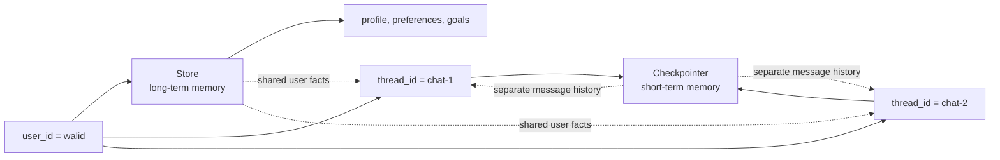
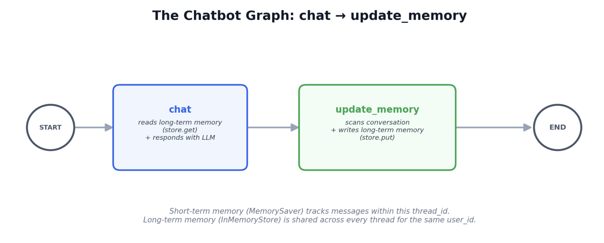

# 8. Long-Term Memory — Remembering Across Conversations

## TL;DR

- A **checkpointer** remembers one conversation (`thread_id`). A **Store**
  remembers selected facts across many conversations (a namespace that usually
  contains `user_id`).
- Attach both at compile time: `builder.compile(checkpointer=..., store=...)`.
- Pass `thread_id` in `config` and `user_id` in runtime `context`; nodes read
  the Store through `runtime.store`.
- A Store entry is **namespace + key → value** (the value is always a dict).
- "Long-term" describes **scope** (across threads), not **durability**.
  `InMemoryStore` is erased when Python stops; `PostgresStore` survives.
- Long-term memories come in three kinds: **semantic** (facts),
  **episodic** (past experiences), and **procedural** (instructions).

```python
graph = builder.compile(checkpointer=MemorySaver(), store=InMemoryStore())

config = {"configurable": {"thread_id": "chat-1"}}   # which conversation
context = Context(user_id="walid")                    # which user

graph.invoke({"messages": [...]}, config, context=context)
```

Remember: **checkpointer for this chat; Store for this user.**

## The Big Picture: Two Memory Scopes

Checkpointing (tutorial 7) taught the graph to remember one conversation.
Long-term memory adds a different ability: remembering selected user or
application facts across many separate conversations.


```mermaid
flowchart LR
    U["user_id = walid"] --> STORE["Store<br/>long-term memory"]
    STORE --> PROFILE["profile, preferences, goals"]

    U --> T1["thread_id = chat-1"]
    U --> T2["thread_id = chat-2"]
    T1 --> CP["Checkpointer<br/>short-term memory"]
    T2 --> CP

    CP -. "separate message history" .-> T1
    CP -. "separate message history" .-> T2
    STORE -. "shared user facts" .-> T1
    STORE -. "shared user facts" .-> T2
```

| Memory | Scope | LangGraph component | Lookup identity |
|---|---|---|---|
| Short-term | one chat or workflow | checkpointer | `thread_id` |
| Long-term | many chats for a user or application | Store | namespace, often containing `user_id` |

Most production agents use both: the checkpointer remembers what happened in
*this* conversation; the Store remembers what should be available in *future*
conversations.

### Scope is not durability

"Long-term" means the memory is shared across different `thread_id` values. It
does **not** mean the memory survives a restart. The Store backend decides
that:

| Store | Shared across threads? | Survives Python restart? | Practical use |
|---|---:|---:|---|
| `InMemoryStore` | yes | no | learning, tests, temporary applications |
| `PostgresStore` | yes | yes | durable production memory |

```text
same process + different thread_id  → memory is shared by user_id
new Python process                  → InMemoryStore data is gone
```

Examples 00–02 and 04–06 use `InMemoryStore` so they run without a database.
Example 03 switches to `PostgresStore` to prove durability.

## Start Here

Run every command from the repository root.

| # | File | Demonstrates | Needs |
|---|---|---|---|
| 1 | [`00_store_basics.py`](00_store_basics.py) | `put`, `get`, `search`, namespaces, keys, `Item` fields | nothing (no LLM) |
| 2 | [`01_simple_cross_thread_memory.py`](01_simple_cross_thread_memory.py) | chatbot sharing one plain-text profile across two threads | `OPENAI_API_KEY` |
| 3 | [`02_structured_cross_thread_memory.py`](02_structured_cross_thread_memory.py) | structured extraction, field merging, user isolation | `OPENAI_API_KEY` |
| 4 | [`03-postgres-store/`](03-postgres-store/README.md) | memory that survives between Python processes | PostgreSQL (no LLM) |
| 5 | [`04_semantic_memory_tools.py`](04_semantic_memory_tools.py) | **semantic** memory saved and searched by the agent | `OPENAI_API_KEY`, `langmem` |
| 6 | [`05_episodic_memory.py`](05_episodic_memory.py) | **episodic** memory as few-shot examples | `OPENAI_API_KEY` |
| 7 | [`06_procedural_memory.py`](06_procedural_memory.py) | **procedural** memory rewritten from feedback | `OPENAI_API_KEY`, `langmem` |

```bash
python "8-Long-Term-Memory/00_store_basics.py"
python "8-Long-Term-Memory/01_simple_cross_thread_memory.py"
python "8-Long-Term-Memory/02_structured_cross_thread_memory.py"
# 03: follow 03-postgres-store/README.md (needs a running PostgreSQL)
python "8-Long-Term-Memory/04_semantic_memory_tools.py"
python "8-Long-Term-Memory/05_episodic_memory.py"
python "8-Long-Term-Memory/06_procedural_memory.py"
```

`OPENAI_API_KEY` goes in the repository-root `.env` file. `langmem` is listed
in the root `requirements.txt`.

## The Store: Namespace + Key → Value

A Store organizes each memory with three pieces:

```text
namespace = ("walid", "memories")   ← folder path (a tuple)
key       = "profile"               ← filename
value     = {                       ← saved contents (always a dict)
    "name": "Walid",
    "role": "software engineer",
    "preferences": ["concise explanations"]
}
```

The namespace groups related entries and provides isolation. Putting the
`user_id` in it gives every user a separate memory space:

```text
("walid", "memories")
├── profile
└── learning_goal

("guest", "memories")
└── profile
```

Calling `put` again with the same namespace and key **updates** that entry.

> **Plain text is still a value.** To remember a paragraph, wrap it in a dict:
> `store.put(ns, "user_details", {"memory": profile_text})`, and read it back
> with `item.value["memory"]`. The text is the content of a field, never the
> key.

### Operations

```python
from langgraph.store.memory import InMemoryStore

store = InMemoryStore()
namespace = ("walid", "memories")

store.put(namespace, "profile", {"name": "Walid"})
item = store.get(namespace, "profile")   # Item or None
print(item.value)                        # {'name': 'Walid'}
all_items = store.search(namespace)      # list of items in the namespace
```

| Operation | Purpose |
|---|---|
| `put(namespace, key, value)` | create or update one memory |
| `get(namespace, key)` | fetch one exact memory; returns `None` when absent |
| `search(namespace_prefix, query=..., filter=..., limit=...)` | list memories under a prefix; with `query`, rank by meaning (needs an embedding index) |
| `delete(namespace, key)` | remove one memory |

`get` and `search` return `Item` objects, not just the dict:

| Item field | Meaning |
|---|---|
| `namespace` | the tuple path containing the memory |
| `key` | the entry identifier inside that namespace |
| `value` | the dictionary your application saved |
| `created_at` / `updated_at` | when the item was created / last changed |
| `score` | similarity score, only for a semantic `search(query=...)` |

`put` also accepts `index` (which fields to embed) and `ttl` (expiry, on
backends that support it). You won't need them until examples 04–05.

### Walkthrough 1 — Store basics (`00_store_basics.py`)

No graph and no LLM: the script puts a profile, gets it back, prints every
`Item` field, lists the namespace with `search`, then puts the same key again
to show an update. Run it first; everything after builds on these four calls.

## Wiring a Store into a Graph

Identity has two jobs, so it travels through two channels:

- `thread_id` in **`config`** selects the checkpoint history (short-term).
- `user_id` in runtime **`context`** selects the Store namespace (long-term).

```python
from dataclasses import dataclass
from langgraph.runtime import Runtime

@dataclass
class Context:
    user_id: str

builder = StateGraph(MessagesState, context_schema=Context)

def chat(state: MessagesState, runtime: Runtime[Context]):
    user_id = runtime.context.user_id
    item = runtime.store.get((user_id, "memories"), "profile")
    ...

graph = builder.compile(checkpointer=MemorySaver(), store=InMemoryStore())

graph.invoke(
    {"messages": [{"role": "user", "content": "Hi"}]},
    {"configurable": {"thread_id": "walid-chat-1"}},
    context=Context(user_id="walid"),
)
```

`context_schema=Context` declares the context type, so LangGraph can inject a
typed `Runtime[Context]` into each node. `runtime.store` is whichever Store you
passed to `compile`.

> **Why `@dataclass`?** It generates `__init__` for you, so
> `Context(user_id="walid")` works without boilerplate. LangGraph doesn't
> require it; any small typed class works.

## The Chat → Update-Memory Pattern

Examples 01 and 02 use the same two-node graph. They separate *answering*
from *remembering*:



```text
START → chat → update_memory → END
```

- **`chat`** reads the user's profile from the Store, adds it to the system
  message, and answers using it together with this thread's messages.
- **`update_memory`** looks only at the **latest human message**, extracts facts
  the user explicitly stated, and writes them back to the Store. Ignoring
  assistant messages keeps invented claims out of memory.
- `MemorySaver` keeps each `thread_id`'s messages separate; the Store shares the
  profile across threads for the same `user_id`.

`update_memory` is a second LLM call. That makes the flow easy to see, but in
production decide carefully when extraction is worth the latency and cost.

### Walkthrough 2 — Plain-text profile (`01_simple_cross_thread_memory.py`)

The simplest version. The whole profile is one block of LLM-written text in one
Store entry:

```python
namespace = ("memory", runtime.context.user_id)
runtime.store.put(namespace, "user_details", {"memory": updated_profile.content})
```

Each update **replaces** the entire profile with a newly merged one. The script
runs two threads for the same user:

```text
thread-1, user-1 → "My name is Walid, I'm a software engineer…" → profile saved
thread-2, user-1 → no thread-1 messages, but the profile is loaded
                 → "I am now an engineering manager" → profile updated
```

This file uses `("memory", user_id)` / `"user_details"`, while 00 and 02 use
`(user_id, "memories")` / `"profile"`. Both work: any namespace that contains
the `user_id` keeps users apart.

### Walkthrough 3 — Structured profile (`02_structured_cross_thread_memory.py`)

The safer version. The extractor returns a Pydantic schema instead of free
text, and new values are merged field by field into the existing profile:

```text
Thread 1, user walid → states name, role, preference → profile saved
Thread 2, user walid → new thread_id (no old messages), same profile
                     → states a newer role → that field is updated
Thread 3, user guest → different user_id → empty, isolated namespace
```

It also prints the `Item` metadata (`created_at`, `updated_at`) so you can see
the update happen.

## Making It Durable: `PostgresStore`

Moving to production changes only the backend; the graph code stays the same:

```python
from langgraph.store.postgres import PostgresStore

with PostgresStore.from_conn_string(DB_URI) as store:
    store.setup()  # once, for a new database
    graph = builder.compile(checkpointer=checkpointer, store=store)
```

Don't confuse it with the checkpointer of tutorial 7:

| PostgreSQL component | Stores | Scoped by |
|---|---|---|
| `PostgresSaver` | checkpoints and thread state | `thread_id` |
| `PostgresStore` | cross-thread facts and memories | namespace such as `(user_id, "memories")` |

A production graph usually compiles with both.

### Walkthrough 4 — Surviving a restart (`03-postgres-store/`)

One Python process writes a structured profile and exits; a second process
reconnects and reads it back. No LLM is used, so the result is deterministic.
Follow the [setup and run guide](03-postgres-store/README.md).

## Three Types of Long-Term Memory

Examples 00–03 store a single profile. Real assistants remember different
*kinds* of things:

| Type | What it remembers | Study-assistant example |
|---|---|---|
| Semantic | facts about people, places, or things | the user's goal and preferred language |
| Episodic | past experiences and their outcomes | an approved explanation reused as a few-shot example |
| Procedural | instructions for how to behave | tone and answer-format rules |

The type describes what a memory *contains and is for*. It is independent of
the backend: any of them can live in `InMemoryStore` or `PostgresStore`.

| File | Type | Written by | Found by |
|---|---|---|---|
| [`04_semantic_memory_tools.py`](04_semantic_memory_tools.py) | semantic | the agent, via LangMem `manage_memory` (while answering) | embedding search via `search_memory` |
| [`05_episodic_memory.py`](05_episodic_memory.py) | episodic | the app, after the user approves (background) | `store.search(namespace, query=request)` |
| [`06_procedural_memory.py`](06_procedural_memory.py) | procedural | a LangMem prompt optimizer, from feedback (background) | exact `store.get(namespace, key)` |

All three use the namespace `("assistant", user_id, <kind>)` so each user's
memories stay isolated. 04 and 05 create the Store with an embedding index
(`InMemoryStore(index={"embed": ..., "dims": 1536})`) so `search(query=...)`
matches by meaning. They take the user from
`config["configurable"]["langgraph_user_id"]`, the convention LangMem's tools
expect.

### Walkthrough 5 — Semantic memory (`04_semantic_memory_tools.py`)

The agent gets two tools. In run 1 the user states facts and the agent calls
`manage_memory` to save them. In run 2, which shares no messages with run 1,
the agent calls `search_memory` and personalizes its answer. A different user's
namespace stays empty.

### Walkthrough 6 — Episodic memory (`05_episodic_memory.py`)

When the user approves an explanation, the exchange is saved as an episode.
For a later, similar request, the closest episodes are retrieved and shown to
the model as few-shot examples, so the new answer follows the approved format
without any change to the instructions.

### Walkthrough 7 — Procedural memory (`06_procedural_memory.py`)

The system prompt is rebuilt from named instruction sections stored in the
Store. When the user gives feedback, a LangMem optimizer rewrites only the
section the feedback is about; the next answer follows the new rule, and other
users keep the defaults.

## Design Guidance

- Save useful, stable facts, not every sentence.
- Keep users isolated by including a trusted `user_id` in the namespace.
- Do not let a user choose another user's namespace.
- Treat model-extracted memories as untrusted data that may need validation.
- Define how contradictions work; these examples keep the newest explicit value.
- Provide deletion and correction paths for personal information.
- Use semantic search only when exact key or namespace lookup is insufficient.

## Key Takeaways

1. A checkpointer remembers one thread; a Store shares memory across threads.
2. `thread_id` (in `config`) identifies the conversation; `user_id` (in
   `context`) identifies the user.
3. Store data is namespace + key → dict, and `put` on an existing key updates
   it.
4. Scope is not durability: `InMemoryStore` is for learning; `PostgresStore`
   survives restarts.
5. Semantic, episodic, and procedural memory differ in what they hold and how
   they are written and found, not in where they are stored.

## Where to Go Next

Continue to [`9-Email-Assistant/`](../9-Email-Assistant/), which combines
short-term memory with all three long-term memory types in one application,
introduced one lesson at a time. To revisit thread-scoped memory, see
[`7-Checkpointing/`](../7-Checkpointing/).

## References

- [LangGraph memory](https://docs.langchain.com/oss/python/langgraph/add-memory)
- [LangGraph persistence and Store](https://docs.langchain.com/oss/python/langgraph/persistence)
- [Long-term memory Store notebook (additional examples)](https://github.com/Kerolos2019/Agentic_ai_using_LangGrph/blob/main/17_longterm-memory-store.ipynb)
