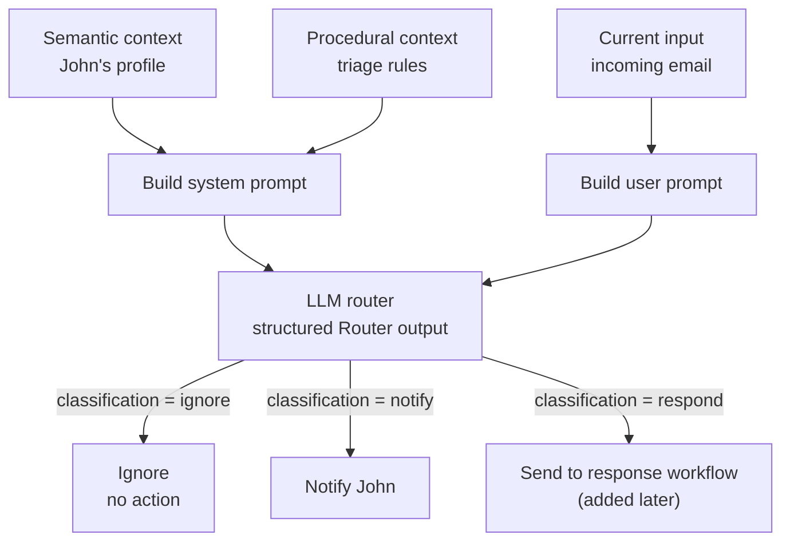
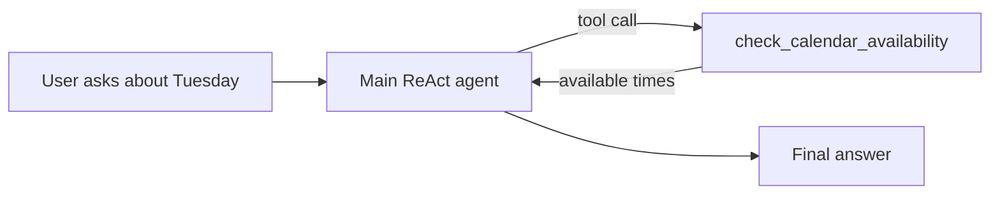
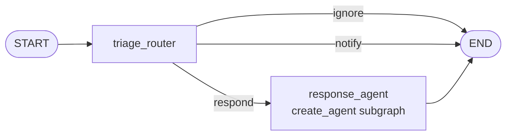
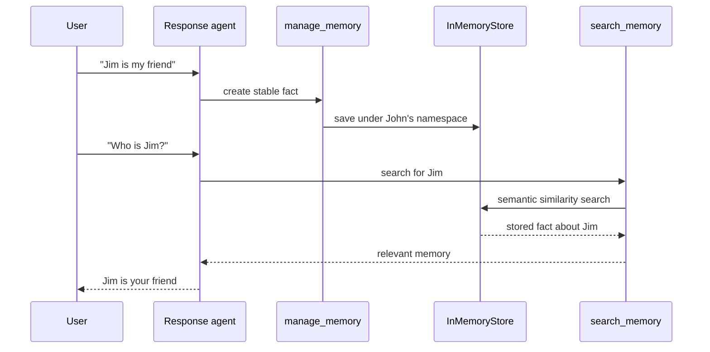
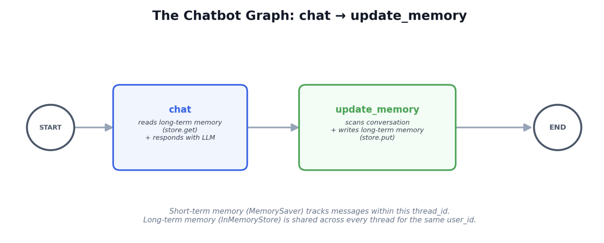
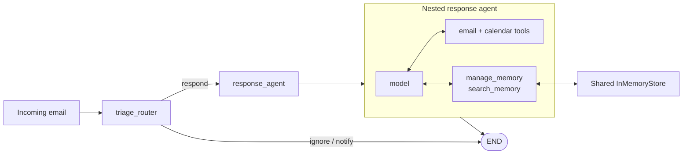

# Email Assistant — Built Gradually

This tutorial builds an email assistant one small capability at a time. The
first lesson tests email triage before introducing a graph, tools, or stored
memories.

## One-Page Reference

Use [`Email Assistant Memory Map`](Email_Assistant_Memory_Map.docx) as the
one-page visual reference for the assistant's short-term, semantic, and
episodic, and procedural memory. It shows how each memory type is read and
written, where chat and embedding models participate, and how memory is scoped
per thread or user.

## Learning Path

| Lesson | File | Adds |
|---|---|---|
| 1 | [`01_triage.py`](01_triage.py) | structured email classification |
| 2 | [`02_main_agent_tools.py`](02_main_agent_tools.py) | high-level agent with simulated tools |
| 3 | [`03_overall_email_agent.py`](03_overall_email_agent.py) | outer triage graph and response-agent handoff |
| 4 | [`04_semantic_memory.py`](04_semantic_memory.py) | standalone semantic-memory save, search, and inspection |
| 5 | [`05_full_agent_semantic_memory.py`](05_full_agent_semantic_memory.py) | complete triage + response with short- and long-term memory |
| 6 | [`06_episodic_memory.py`](06_episodic_memory.py) | human-corrected triage examples retrieved as few-shot episodes |
| 7 | [`07_procedural_memory.py`](07_procedural_memory.py) | user feedback optimized into stored triage and agent instructions |
| 7a | [`07a_prompt_optimizer_minimal.py`](07a_prompt_optimizer_minimal.py) | minimal one-rule prompt-optimizer read/write cycle |
| 7b | [`07b_prompt_optimizer_no_store.py`](07b_prompt_optimizer_no_store.py) | smallest optimizer example using only a Python string |
| 8 | [`08_integrated_memory_agent.py`](08_integrated_memory_agent.py) | one graph combining short-term, semantic, episodic, and procedural memory |

Lessons 1–3 introduce procedural prompt context but no persistent procedural
memory. Lessons 4–5 implement semantic memory. Lesson 6 implements episodic
few-shot memory. Lesson 7 implements learned procedural memory. Lesson 8
combines every memory type in one graph.

## Lesson 1: Triage One Email

Run:

```bash
python "9-Email-Assistant/01_triage.py"
```

Each run writes the exact formatted prompts sent to the model to:

```text
9-Email-Assistant/logs/triage_prompts.log
```

The file is overwritten on each run so it always represents the latest email.
It contains both an `=== SYSTEM PROMPT ===` section and an
`=== USER PROMPT ===` section. Because the user section contains the incoming
email, do not commit this log when testing with real or sensitive messages.

The router returns one structured classification:

- `ignore` — irrelevant or unwanted email;
- `notify` — important information that does not need a reply;
- `respond` — email that needs a direct reply.

### How the triage router works



The router does not yet execute these actions or use LangGraph conditional
edges. It only returns a structured `classification` and `reasoning`. A later
lesson can use the classification to choose the next graph node.

### Memory concepts at this stage

| Value | Meaning | Memory type |
|---|---|---|
| `profile` | facts about John and his role | semantic |
| `prompt_instructions["triage_rules"]` | instructions for classifying email | procedural |
| `examples` | currently disabled | episodic, added later |
| `email` | the current task | not memory |

### Where the semantic profile is passed

The profile starts as a Python dictionary:

```python
profile = {
    "name": "John",
    "full_name": "John Doe",
    "user_profile_background": (
        "Senior software engineer leading a team of 5 developers"
    ),
}
```

The script inserts each profile field into `triage_system_prompt`:

```python
system_prompt = triage_system_prompt.format(
    full_name=profile["full_name"],
    name=profile["name"],
    user_profile_background=profile["user_profile_background"],
    # The triage rules are also inserted here.
)
```

This fills prompt placeholders such as `{full_name}`, `{name}`, and
`{user_profile_background}`. The completed prompt is then sent to the model as
the system message:

```python
result = llm_router.invoke(
    [
        {"role": "system", "content": system_prompt},
        {"role": "user", "content": user_prompt},
    ]
)
```

The flow is:

```text
profile dictionary
    → .format(...) fills the system-prompt placeholders
    → system_prompt contains John's facts
    → llm_router.invoke(...) sends those facts to the model
```

At this first stage, the profile is hard-coded context. It demonstrates the
**content of semantic memory**, but it is not persistent memory yet. A later
lesson will save and retrieve the profile with a LangGraph Store.

The example email contains a direct question from a team member, so the
expected classification is `respond`.

Future lessons will add examples, tools, LangGraph orchestration, and persistent
memory separately.

## Lesson 2: Main Agent with Tools

Run:

```bash
python "9-Email-Assistant/02_main_agent_tools.py"
```

This lesson creates a separate ReAct agent with three tools:

| Tool | Purpose |
|---|---|
| `write_email` | simulate writing and sending an email |
| `schedule_meeting` | simulate scheduling a meeting |
| `check_calendar_availability` | return example available times |

All three tools are local simulations. They do not send email, connect to a
calendar, or make external changes.

### Are these actual tools?

Yes. They are **actual LangChain tools** because the Python functions use the
`@tool` decorator:

```python
@tool
def check_calendar_availability(day: str) -> str:
    return f"Available times on {day}: 9:00 AM, 2:00 PM, 4:00 PM"
```

The decorator exposes the function's name, description, and argument schema to
the model. The agent can choose the tool, generate its arguments, execute the
Python function, and use its returned result.

However, they are not real-world integrations yet:

| Tool | Agent-callable? | Current implementation | External effect? |
|---|---:|---|---:|
| `write_email` | yes | returns a simulated confirmation | no email is sent |
| `schedule_meeting` | yes | returns a simulated confirmation | no event is created |
| `check_calendar_availability` | yes | returns hard-coded example times | no calendar is read |

Therefore, they are **real tools with mock behavior**. A production version
would keep the tool interfaces but replace their bodies with authenticated
email and calendar API calls, appropriate error handling, and user approval
before consequential actions.

The `create_system_prompt` function formats the baseline agent prompt:

```python
def create_system_prompt():
    return agent_system_prompt.format(
        instructions=prompt_instructions["agent_instructions"],
        **profile,
    )
```

This supplies:

- semantic context from `profile`, such as John's name;
- procedural context from `agent_instructions`;

`create_agent` receives that text through its `system_prompt` argument. The
conversation supplied to `agent.invoke(...)` becomes the user-message context.

The agent decides whether it needs a tool. For the question “What is my
availability for Tuesday?”, it should call `check_calendar_availability` and
use the tool result in its final answer:



Lesson 1 and Lesson 2 remain separate:

```text
Lesson 1: incoming email → triage classification
Lesson 2: user request → main agent → optional tool call
```

## Lesson 3: Overall Email Agent

Run:

```bash
python "9-Email-Assistant/03_overall_email_agent.py"
```

The script prints the Mermaid graph to the terminal and saves its rendered PNG
to:

```text
9-Email-Assistant/diagrams/overall_email_agent_graph.png
```

After rendering, the terminal prints the file's complete absolute path so it is
easy to locate from any IDE. If PNG rendering fails, the terminal clearly says
that no file was saved and still prints the intended location.

This lesson combines the first two concepts in a custom LangGraph:



The shared graph state contains:

```python
class State(TypedDict):
    email_input: dict
    messages: Annotated[list, add_messages]
```

- `email_input` holds the email being processed;
- `messages` carries the conversation into and out of the response agent;
- `add_messages` merges new messages instead of replacing the message history.

### Routing with `Command`

`triage_router` returns a LangGraph `Command` containing:

- `goto` — the next node;
- `update` — an optional state update.

For `respond`, it creates a user message and routes to `response_agent`.
For `ignore` and `notify`, it routes directly to `END`.

```text
respond → add response request to messages → response_agent
ignore  → END
notify  → END (a real application could route to a notification node)
```

The response agent is itself a graph produced by LangChain's high-level
`create_agent` API. Adding it as `response_agent` nests that standard
tool-calling agent inside the custom email-routing graph.

All three tools remain simulated. Even if the response agent calls
`write_email`, no real email is sent.

### Testing two routes

Lesson 3 runs two emails through the same compiled graph:

| Test email | Expected route | Expected result |
|---|---|---|
| promotional developer-tools discount | `ignore` | graph ends without response-agent messages |
| Alice's API-documentation question | `respond` | graph enters `response_agent` |

For the `respond` route, the script prints every message. This exposes the
complete agent trace: the generated response request, any AI tool call, the
simulated tool result, and the final AI message. For the `ignore` route, the
empty message trace confirms that the response agent did not run.

## Lesson 4: Semantic Memory

Run:

```bash
python "9-Email-Assistant/04_semantic_memory.py"
```

This lesson gives the response agent two real memory tools from LangMem:

| Tool | Purpose |
|---|---|
| `manage_memory` | create, update, or delete a stored memory |
| `search_memory` | retrieve memories relevant to a query |

The tools use a LangGraph `InMemoryStore` with an OpenAI embedding index:

```python
store = InMemoryStore(
    index={
        "embed": "openai:text-embedding-3-small",
        "dims": 1536,
    }
)
```

Memories are isolated by a runtime user identifier:

```text
("email_assistant", "{langgraph_user_id}", "collection")
```

At invocation time, `{langgraph_user_id}` is replaced with the value in:

```python
config = {"configurable": {"langgraph_user_id": "john"}}
```

The resulting namespace is:

```text
("email_assistant", "john", "collection")
```

### Save and recall flow



This is semantic memory because the Store holds a reusable fact about a person.
The current user message is not the memory; the normalized fact written by
`manage_memory` is.

The same Store instance is passed to both invocations through `create_agent`.
Therefore, the second invocation can retrieve what the first invocation saved.
Because this lesson uses `InMemoryStore`, the fact disappears when the Python
process stops. A durable Store such as `PostgresStore` would preserve it across
restarts.

### Comparison with the explicit update-memory pattern

Tutorial 8 also demonstrates a graph with a dedicated memory-writing node:



```text
chat → update_memory
```

The Email Assistant uses a different valid design: `manage_memory` and
`search_memory` are tools inside the response agent. The model decides when to
call them. The explicit-node design is easier to enforce deterministically;
the memory-tool design is more flexible but depends on the agent choosing the
correct tool.

The complete tool traces are written to:

```text
9-Email-Assistant/logs/04_semantic_memory_messages.log
```

That log shows the user message, `manage_memory` call, stored-memory result,
`search_memory` call, retrieved result, and final answer. It is ignored by Git
because memory content may be sensitive.

### Direct Store inspection

After both agent invocations, `main()` calls:

```python
inspect_store(user_id="john", query="Jim")
```

The helper keeps `main()` short while making five direct Store operations
visible:

1. `store.list_namespaces()` discovers the namespaces currently in memory.
2. `store.search(namespace)` lists every item for John.
3. `store.search(namespace, query="Jim")` performs embedding-based semantic
   search and prints each similarity score.
4. `store.get(namespace, key)` retrieves the best match by its exact key.
5. Searching another user's namespace returns zero items, demonstrating user
   isolation.

The agent normally accesses these operations through `manage_memory` and
`search_memory`. Direct inspection is included for teaching and debugging so
you can see what those tools store and retrieve internally.

## Lesson 5: Full Agent with Semantic Memory

Run:

```bash
python "9-Email-Assistant/05_full_agent_semantic_memory.py"
```

This lesson combines the previous parts:



The outer graph handles deterministic email routing. The nested high-level
agent decides which response and memory tools to call. The graph combines a
`MemorySaver` checkpointer with the same `InMemoryStore` used by the nested
agent.

### Two-email demonstration

The first email asks about missing `/auth/refresh` and `/auth/validate`
documentation. The response agent:

1. creates a simulated email draft;
2. stores the sender, topic, and exact request in semantic memory.

The follow-up only says, “Any update on my previous ask?” It deliberately runs
under a different `thread_id`, so it cannot see the first email's short-term
checkpoint history. The response agent:

1. searches memory for Alice's earlier request;
2. uses the retrieved endpoint details when drafting its reply;
3. updates the stored interaction.

The instructions explicitly prohibit inventing decisions or progress. If no
actual update exists in memory or the current email, the draft should say that
no new status is available rather than fabricating one.

### Memory scope

The two emails use different short-term threads:

```text
Email 1 → thread_id = "alice-api-question"
Email 2 → thread_id = "alice-api-follow-up"
```

They share the same long-term user identity:

```python
{"configurable": {"langgraph_user_id": "john"}}
```

Therefore, both emails share this Store namespace:

```text
("email_assistant", "john", "collection")
```

A different user identifier would use a separate memory namespace. Since this
lesson uses `InMemoryStore`, all memories still disappear when the process
ends.

This is the important proof:

```text
MemorySaver + different thread_id
└── does not carry Email 1's conversation state into Email 2

InMemoryStore + same langgraph_user_id/namespace
└── carries selected facts from Email 1 into Email 2
```

### Full memory comparison

| Scope | Temporary / RAM | Durable / PostgreSQL |
| --- | --- | --- |
| Short-term, one thread | `InMemorySaver` / `MemorySaver` | `PostgresSaver` |
| Long-term, across threads | `InMemoryStore` | `PostgresStore` |

`Saver` implementations checkpoint conversation history and graph state under
a `thread_id`. `Store` implementations keep selected facts under a user ID and
namespace so they can be reused across conversations. The in-memory versions
disappear when the Python process stops; the PostgreSQL versions survive
process restarts.

The complete graph is saved to:

```text
9-Email-Assistant/diagrams/05_full_agent_semantic_memory.png
```

The two complete message and tool traces are saved to:

```text
9-Email-Assistant/logs/05_full_agent_semantic_memory.log
```

## Lesson 6: Episodic Memory from Triage Corrections

Run:

```bash
python "9-Email-Assistant/06_episodic_memory.py"
```

This lesson saves a human-corrected email classification and retrieves it when
a similar email arrives later:

```text
email incorrectly or ambiguously classified
    → human supplies the correct label
    → save {email, label} in the user's "examples" namespace
    → semantically retrieve similar examples for a new email
    → insert them into the triage prompt as few-shot examples
    → classify according to the user's demonstrated preference
```

The stored object is an **episodic memory** because it represents a specific
past triage event:

```python
{
    "email": corrected_email,
    "label": "ignore",
    "source": "human_correction",
}
```

The Store uses embeddings to find a similar episode even when the sender and
wording change. That retrieval mechanism is semantic search, but the memory's
content and purpose are episodic: “a similar email occurred, and John corrected
its classification to `ignore`.”

### Episodic memory versus ordinary few-shot examples

You can use few-shot prompting without memory. In that simpler design, examples
are hard-coded and the same examples are placed in every prompt:

```python
examples = [
    {"email": "...", "label": "ignore"},
    {"email": "...", "label": "respond"},
]
```

In this lesson, the few-shot examples come from the user's earlier experiences
and corrections. They are saved in a Store and selected dynamically:

```text
past email + human correction
    → save as episodic memory
    → semantically search for similar episodes
    → insert retrieved episodes as few-shot examples
    → classify the new email
```

These terms describe three different parts of the same flow:

| Concept | Role in Lesson 6 |
| --- | --- |
| Episodic memory | the past email and its human-corrected classification |
| Semantic search | the mechanism that selects relevant past episodes |
| Few-shot prompting | the way retrieved episodes guide the model |

In short:

```text
Episodic memory = what is stored
Semantic search = how it is selected
Few-shot prompting = how it is used
```

Without the Store, these would be ordinary static few-shot examples. With the
Store, the assistant can accumulate corrections over time and retrieve the
examples most relevant to each new email.

### Is there a human in the loop?

Conceptually, yes. The episodic example is created from human feedback:

```text
assistant classifies an email
    → John supplies the preferred classification
    → save_triage_correction(...) stores the approved episode
    → a future similar email retrieves that correction
```

In the current teaching script, this feedback step is simulated:

```python
print("HUMAN FEEDBACK: John wants no-action deployment FYIs ignored")
save_triage_correction(user_id, corrected_email, "ignore")
```

The script calls the correction function directly. It does not pause execution
and wait for a real person through LangGraph's `interrupt()` and resume
mechanism.

It also does **not** ask the user for feedback after every classification.
Lesson 6 contains one pre-programmed correction purely to demonstrate how an
approved classification becomes episodic memory.

| Capability | Included in Lesson 6? |
| --- | ---: |
| Human-feedback concept | yes |
| Human-approved label stored as an episode | yes, simulated |
| Feedback requested after every classification | no |
| Selective feedback based on uncertainty or risk | no, future extension |
| Interactive pause for a real user | no |
| LangGraph `interrupt()` and resume | no |

Episodic memory does not always require human feedback. An application could
also store successful agent runs, confirmed outcomes, or selected interaction
history as episodes. Human corrections are useful for this triage example
because they provide trusted demonstrations of John's preferences.

### Recommended feedback policy for a real assistant

Requesting feedback after every email would create unnecessary interruptions.
A production assistant should normally ask selectively:

```text
high-confidence routine classification
    → continue automatically

low-confidence or unfamiliar email
    → ask the user to confirm

user manually overrides a classification
    → save the correction as episodic memory

sensitive or high-impact action
    → always request approval
```

A later interactive lesson could use LangGraph `interrupt()` when the
classification is uncertain, no trusted similar episode exists, rules conflict
with retrieved examples, or the action is sensitive. The current lesson only
teaches the narrower mechanism of storing and reusing a correction.

### What this lesson proves

The script runs three comparisons:

1. classify a no-action deployment update before feedback (the static rules
   normally suggest `notify`);
2. save John's `ignore` correction, then classify a similar email while the
   corrected episode is available;
3. classify the same email under another user ID, proving that John's examples
   are isolated in his namespace.

### Why this is not learned procedural memory

The triage rules and system prompt describe **procedural context**—how the
assistant should perform triage—but they remain hard-coded. Lesson 6 changes
behavior through retrieved examples; it does not rewrite the rules or system
instructions.

| Memory type | Present in the tutorial by this point? | Representation |
| --- | ---: | --- |
| Semantic | yes, from Lessons 4–5 | reusable facts in the `collection` namespace |
| Episodic | yes, added in Lesson 6 | corrected `{email, label}` examples in the `examples` namespace |
| Procedural context | yes | hard-coded triage rules and prompts |
| Learned procedural memory | no | would require storing and applying updated instructions |

The example is adapted from the referenced Lesson 4 notebook, with simulated
email behavior, explicit user isolation, safer prompt guidance, and terminology
aligned with this repository.

## Lesson 7: Procedural Memory from User Feedback

Run:

```bash
python "9-Email-Assistant/07_procedural_memory.py"
```

Procedural memory stores **how the assistant should behave**. In this lesson,
the stored procedures include the three triage rules and the response agent's
email/calendar instructions:

```text
("email_assistant", user_id, "procedures")
├── triage_ignore
├── triage_notify
├── triage_respond
└── agent_instructions
```

### Read and write flow

```text
READ
email arrives
    → application uses store.get() to load rules by exact key
    → rules are inserted into the system prompt
    → GPT-4o-mini classifies the email

WRITE
user gives behavioral feedback
    → separate GPT-4o-mini prompt optimizer selects and revises relevant rules
    → application reviews the optimizer result and uses store.put()
    → the next email invocation loads the updated procedures
```

This focused lesson uses the same model name for routing and optimization, but
they are separate calls with separate responsibilities:

| Model role | Responsibility |
| --- | --- |
| Email router | classify the current email using stored procedures |
| Prompt optimizer | translate user feedback into concise instruction changes |

### Why procedural memory does not use embeddings here

Each procedure has a stable key, so the application knows exactly what to load:

```python
store.get(namespace, "triage_ignore")
store.get(namespace, "agent_instructions")
```

The optimizer replaces changed procedures with `store.put()`. There is no need
to search for similar rules, so Lesson 7 creates `InMemoryStore()` without an
embedding index.

| Memory | Retrieval |
| --- | --- |
| Semantic facts | embedding similarity search |
| Episodic examples | embedding similarity search |
| Procedural instructions | exact key lookup |

### Demonstration and safeguards

The initial rules normally classify a no-action deployment FYI as `notify`.
The simulated user feedback says to ignore routine deployment FYIs that
explicitly require no action. The prompt optimizer updates the relevant stored
procedure, and the router loads it on the next classification.

Unlike the source notebook's intentionally unfinished exercise, this adaptation
maps and saves changes for all four prompt types. Defaults are initialized only
when a key is missing, so learned procedures are not overwritten. A
different-user check demonstrates that John's learned instructions remain
isolated under his `user_id`.

This lesson still simulates the feedback call directly. A production system
should validate proposed instruction changes, restrict which procedures may be
edited, keep an audit history, and require approval for sensitive policy
changes.

### Minimal prompt-optimizer example

If Lesson 7 feels too large, run:

```bash
python "9-Email-Assistant/07a_prompt_optimizer_minimal.py"
```

This example removes the graph, router, tools, and embeddings. It shows only
one procedural rule moving through the complete cycle:

```text
store default under key "triage_notify"
    → read current rule with get()
    → send previous interaction + user feedback + current rule
      to create_multi_prompt_optimizer
    → receive one proposed rule
    → save it under the same key with put()
    → read it back with get()
    → rebuild the next system prompt with .format(...)
```

The example prints five labeled stages: the old rule, user feedback, optimizer
proposal, stored value, and rebuilt system prompt. It also makes the division
of responsibility explicit:

```text
create_multi_prompt_optimizer → proposes better prompt text
InMemoryStore                 → remembers that text
application get()/put()       → controls exact reads and writes
```

For an even smaller example with no persistence, run:

```bash
python "9-Email-Assistant/07b_prompt_optimizer_no_store.py"
```

This version keeps the original and optimized rules in ordinary Python
variables:

```text
hard-coded prompt string
    → create_multi_prompt_optimizer
    → optimized prompt string
    → rebuild system prompt in the current process
```

There is no `InMemoryStore`, `get()`, or `put()`. Restarting the script restores
the original hard-coded rule. Therefore, this demonstrates **prompt
optimization**, but not reusable long-term **procedural memory**.

## Lesson 8: Integrated Memory Agent

Run:

```bash
python "9-Email-Assistant/08_integrated_memory_agent.py"
```

Lesson 8 combines all previously isolated mechanisms in one compiled graph:

```text
MemorySaver + thread_id
└── short-term messages and graph state

One shared InMemoryStore + user_id
├── collection  → semantic facts
├── examples    → episodic corrections
└── procedures  → procedural instructions
```

### One invocation

```text
incoming email
    → get() latest procedural triage rules
    → embedding-search relevant episodic examples
    → rebuild triage system prompt from rules + examples
    → router GPT classifies
    → if RESPOND:
         get() latest response-agent instructions
         rebuild response system prompt
         search semantic memory when needed
         use simulated email/calendar tools
         manage semantic memory
```

### All read and write paths

| Memory | Write | Read |
| --- | --- | --- |
| Short-term | checkpointer automatically saves graph state | restored by `thread_id` |
| Semantic | response GPT calls `manage_memory` | response GPT calls `search_memory`; embeddings find facts |
| Episodic | application saves a human-approved `{email, label}` | application embedding-searches examples for the triage prompt |
| Procedural | `create_multi_prompt_optimizer` proposes from feedback; application uses `put()` | application uses exact `get()` and rebuilds system prompts |

The demonstration first stores an episodic correction and retrieves it for a
similar vendor email. It then uses procedural feedback to change the handling
of routine deployment FYIs. Finally, it handles Alice's detailed API request
and recalls that semantic context from a different `thread_id`.

The namespaces share one Store instance but remain isolated per user:

```text
("email_assistant", "john", "collection")
("email_assistant", "john", "examples")
("email_assistant", "john", "procedures")
```

Because the lesson uses `InMemoryStore` and `MemorySaver`, everything disappears
when the Python process stops. The same architecture can use `PostgresStore`
and `PostgresSaver` for restart-safe persistence.
