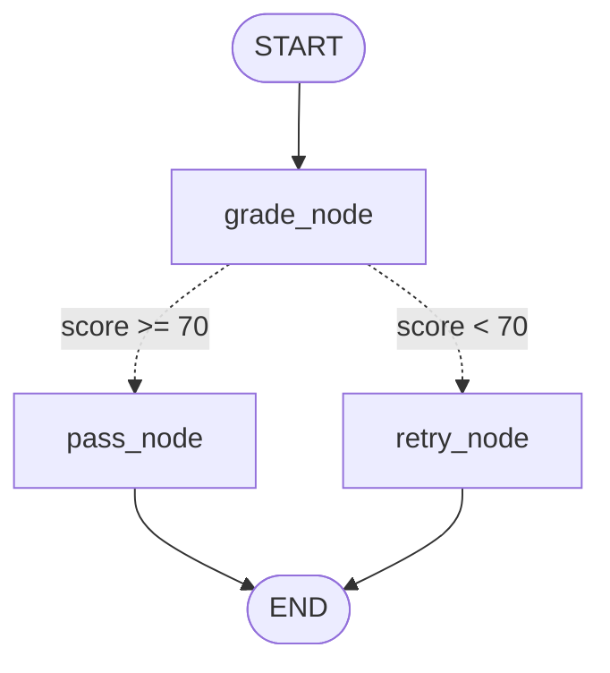
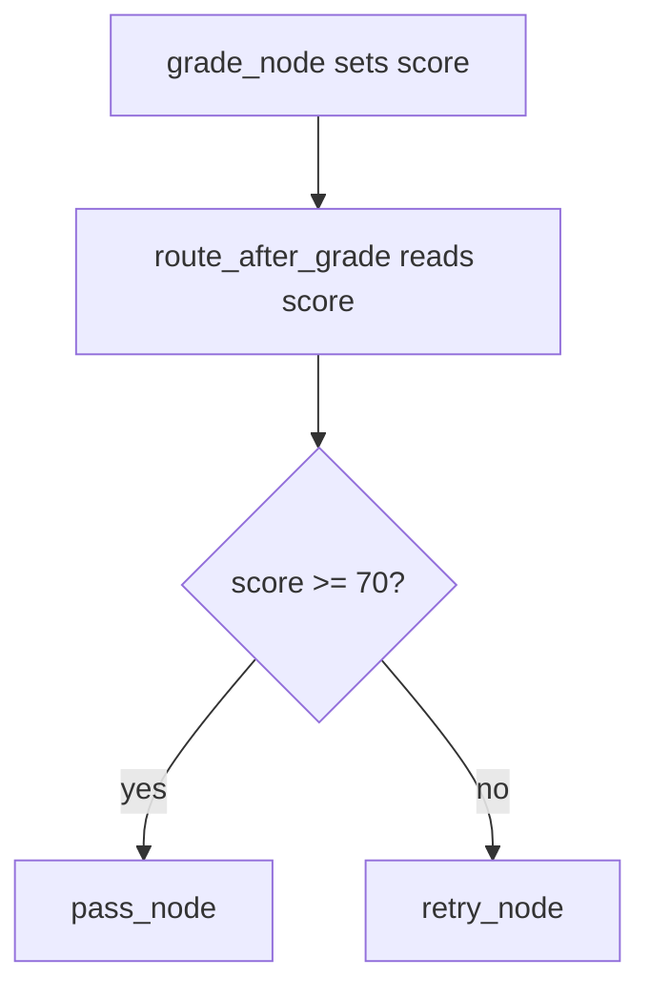

# 4. Conditional Edges

This folder teaches how a graph can choose different paths based on state.

## Goal

Understand how `add_conditional_edges()` lets a router function decide the next node.

This is useful when your workflow needs a decision, such as:

- pass or retry
- approve or reject
- use a tool or skip it
- continue or end

## Graph Plot



Solid edges always run. Dotted edges are conditional.

## What The Example Does

File:

```text
05_conditional_edges.py
```

The graph starts at `grade_node`. That node creates a score.

Then the router reads the score:



If the score is `70` or higher, the graph goes to `pass_node`.
If the score is below `70`, the graph goes to `retry_node`.

## Run

```bash
python "Conditional Edges/05_conditional_edges.py"
```

## Code Explanation

```python
def grade_node(state: AgentState) -> dict:
    if "rag" in state["answer"].lower():
        score = 90
    else:
        score = 50
    return {"score": score}
```

This node reads the answer and returns a score update.

```python
def route_after_grade(state: AgentState) -> str:
    if state["score"] >= 70:
        return "pass_node"
    return "retry_node"
```

This is the router. It is not a normal node. It returns the name of the next node.

```python
graph.add_conditional_edges(
    "grade_node",
    route_after_grade,
    {
        "pass_node": "pass_node",
        "retry_node": "retry_node",
    }
)
```

This connects `grade_node` to multiple possible next nodes. The router decides which one runs.

```python
graph.add_edge("pass_node", END)
graph.add_edge("retry_node", END)
```

Both branches end the graph cleanly.
