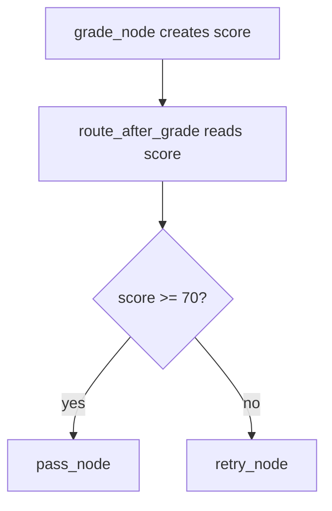

# 4. Conditional Edges

This folder shows how a graph can choose different paths based on state.

## Objective

Understand how to route from one node to different next nodes using `add_conditional_edges()`.

This is useful when the graph should make a decision, such as pass/retry, tool/no tool, approve/reject, or continue/end.

## Graph Plot


## Routing Flow



## File

| File | Covers |
|---|---|
| `05_conditional_edges.py` | Grades an answer, then routes to `pass_node` or `retry_node` |

## Key Code Ideas

- `grade_node` is a normal node that updates state with a score.
- `route_after_grade` is a router function, not a normal node.
- The router reads state and returns the next node name.
- `add_conditional_edges()` connects the source node to possible destinations.
- Both branches eventually go to `END`.

## Normal Edge vs Conditional Edge

| Edge Type | Meaning | Example |
|---|---|---|
| Normal edge | Always go to the next node | `graph.add_edge(START, "grade_node")` |
| Conditional edge | Router decides where to go | `graph.add_conditional_edges("grade_node", route_after_grade, ...)` |

## Run

```bash
python "Conditional Edges/05_conditional_edges.py"
```

## Takeaway

Use conditional edges when the graph needs to choose the next step based on the current state.
