# Exercise Solutions

Solutions to the exercises from tutorials 1–6. Each file is self-contained and runnable from the repo root.

## Structure

| Folder | Tutorial |
|--------|----------|
| `1-basics/` | [1. LangGraph Basics](../1-Langgraph%20basics/README.md) |
| `2-reducers/` | [2. Reducers](../2-Reducer/README.md) |
| `3-llm-messages/` | [3. LLM Messages](../3_LLM_Messages/README.md) |
| `4-conditional-edges/` | [4. Conditional Edges](../4-Conditional%20Edges/README.md) |
| `5-workflows/` | [5. Workflows](../5-Workflows/README.md) |
| `6-agents/` | [6. Agents](../6-Agents/README.md) |

## Running a solution

```bash
python "Exercise-Solutions/1-basics/ex1_second_node.py"
```

Solutions that call the OpenAI API require a `.env` file in the repo root:

```bash
OPENAI_API_KEY=your_key_here
```

## Solutions index

### 1. Basics
| File | Exercise |
|------|----------|
| `1-basics/ex1_second_node.py` | Add a `reverse_node` after `process` |
| `1-basics/ex2_visited_nodes.py` | Track visited nodes with a list reducer |
| `1-basics/ex3_input_validation.py` | Validate input before processing |

### 2. Reducers
| File | Exercise |
|------|----------|
| `2-reducers/ex1_max_reducer.py` | Keep the highest value seen |
| `2-reducers/ex2_deduplicate_list.py` | Append without duplicates |
| `2-reducers/ex3_two_nodes_accumulate.py` | Accumulate count across two nodes |

### 3. LLM Messages
| File | Exercise |
|------|----------|
| `3-llm-messages/ex1_multi_turn.py` | Two-message history, verify recall |
| `3-llm-messages/ex2_system_prompt.py` | Add a system prompt |
| `3-llm-messages/ex3_messages_state.py` | Extend MessagesState with turn_count |

### 4. Conditional Edges
| File | Exercise |
|------|----------|
| `4-conditional-edges/ex1_three_branches.py` | Add a "needs review" branch |
| `4-conditional-edges/ex2_retry_loop.py` | Loop on retry with attempt limit |
| `4-conditional-edges/ex3_llm_grader.py` | Replace keyword scoring with an LLM call |

### 5. Workflows
| File | Exercise |
|------|----------|
| `5-workflows/ex1_tone_step.py` | Extend prompt chain with a casual tone step |
| `5-workflows/ex2_parallel_haiku.py` | Add a haiku branch to the parallelization example |
| `5-workflows/ex3_structured_router.py` | Classify input and route to a specialist node |

### 6. Agents
| File | Exercise |
|------|----------|
| `6-agents/ex1_word_count_tool.py` | Add a word_count tool |
| `6-agents/ex2_iteration_cap.py` | Cap the agent loop at 5 iterations |
| `6-agents/ex3_conversation_memory.py` | Multi-turn agent with carry-over history |


## Graph Gallery

Each solution script calls `plot_graph(...)` when it runs. The diagrams below show the graph shape for each exercise before you open the code.

### 1. Basics

`1-basics/ex1_second_node.py`

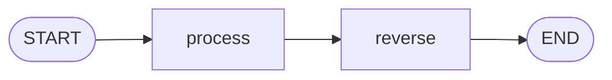

`1-basics/ex2_visited_nodes.py`


`1-basics/ex3_input_validation.py`

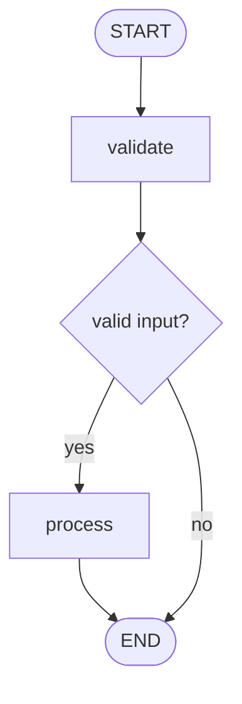

### 2. Reducers

`2-reducers/ex1_max_reducer.py`

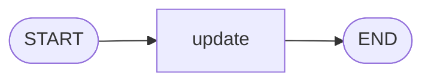

`2-reducers/ex2_deduplicate_list.py`


`2-reducers/ex3_two_nodes_accumulate.py`

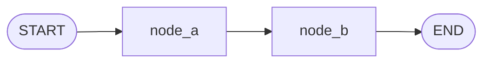

### 3. LLM Messages

`3-llm-messages/ex1_multi_turn.py`


`3-llm-messages/ex2_system_prompt.py`


`3-llm-messages/ex3_messages_state.py`

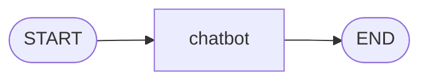

### 4. Conditional Edges

`4-conditional-edges/ex1_three_branches.py`

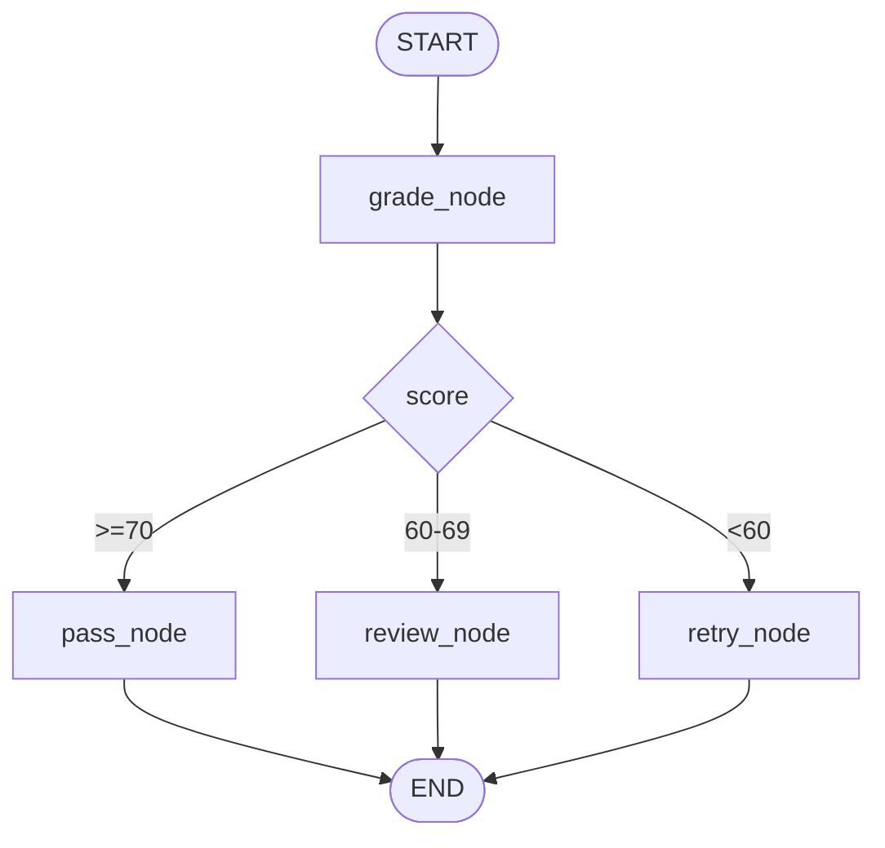

`4-conditional-edges/ex2_retry_loop.py`

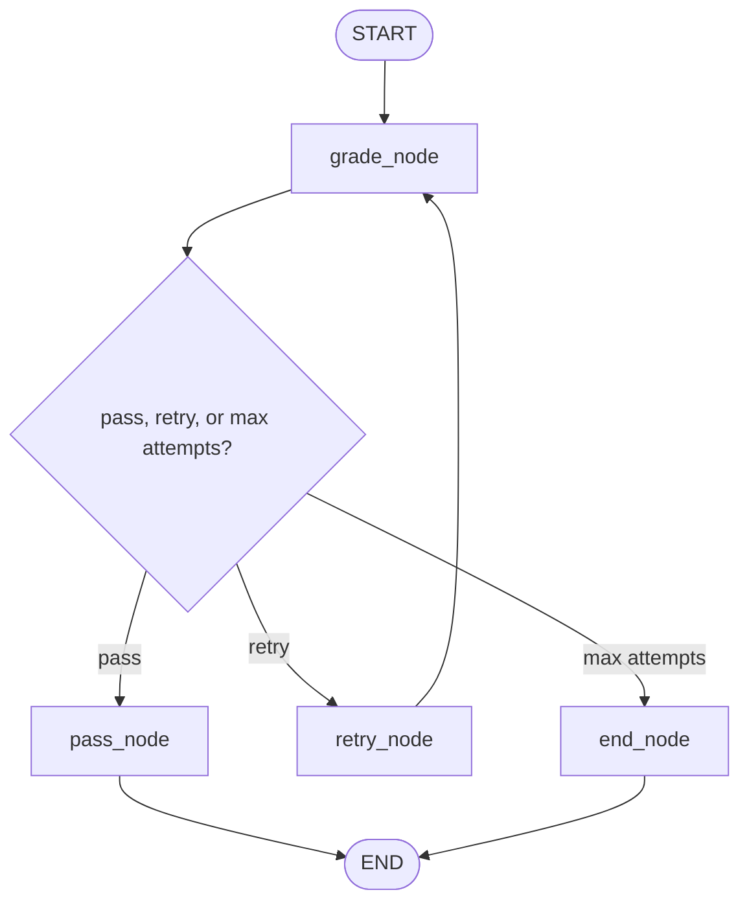

`4-conditional-edges/ex3_llm_grader.py`

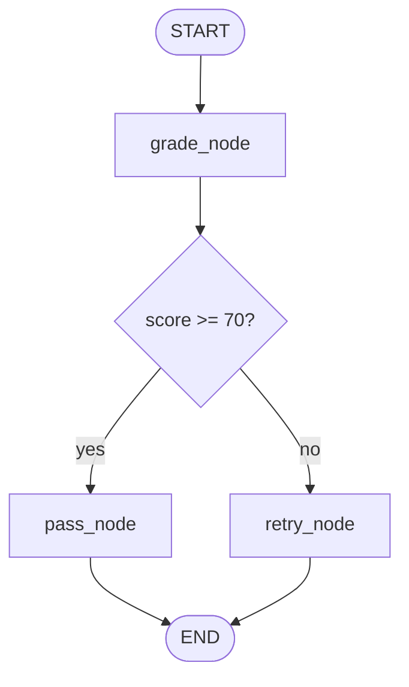

### 5. Workflows

`5-workflows/ex1_tone_step.py`

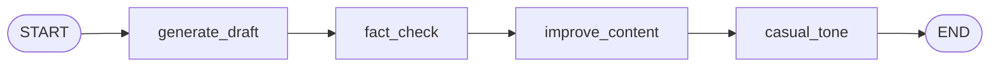

`5-workflows/ex2_parallel_haiku.py`

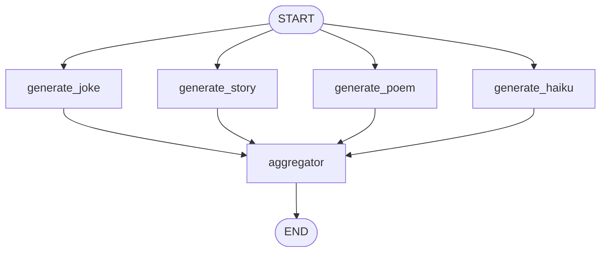

`5-workflows/ex3_structured_router.py`

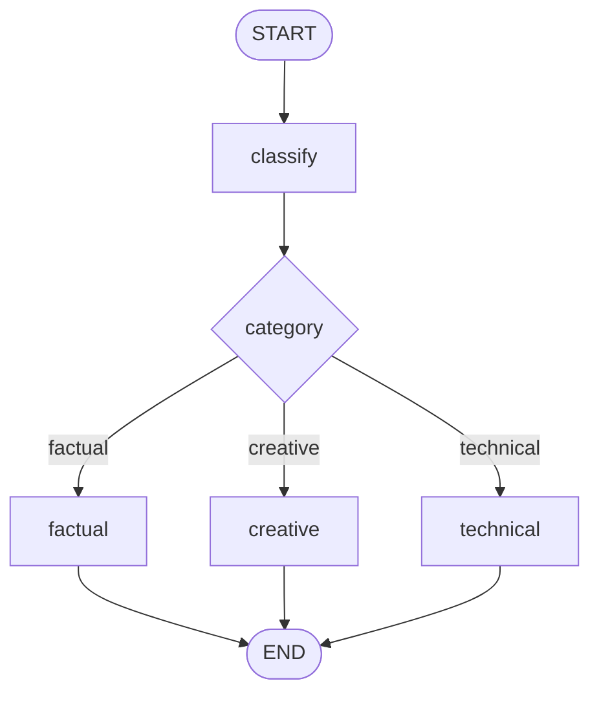

`5-workflows/ex4_evaluator_loop_guard.py`

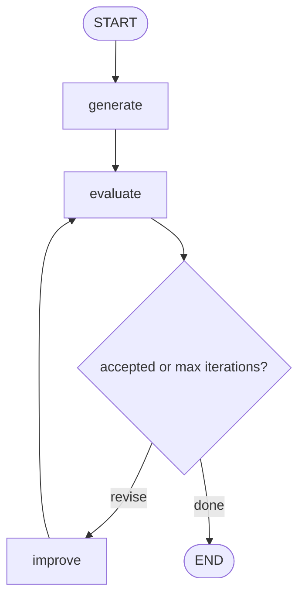

`5-workflows/ex5_evaluator_headline_writer.py`

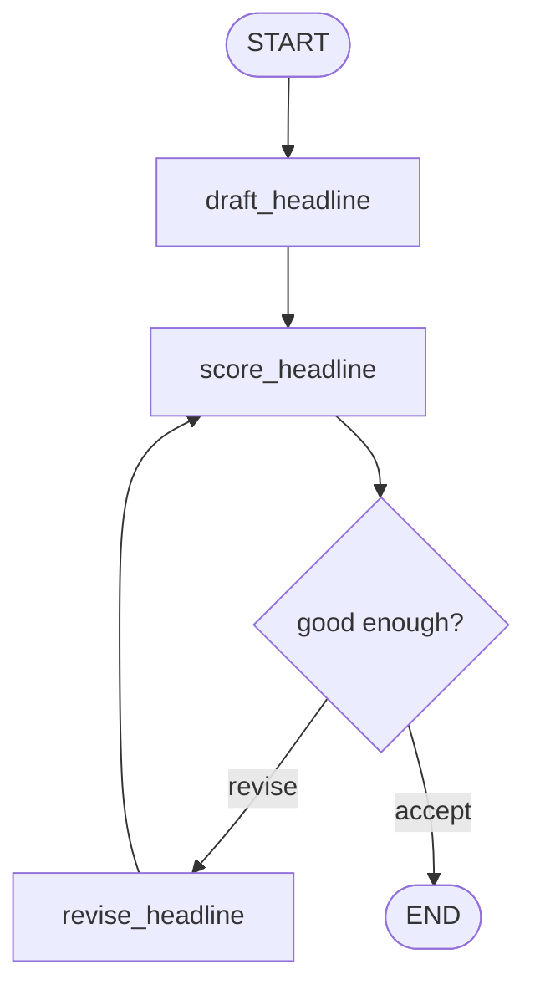

`5-workflows/ex6_evaluator_strict_score.py`

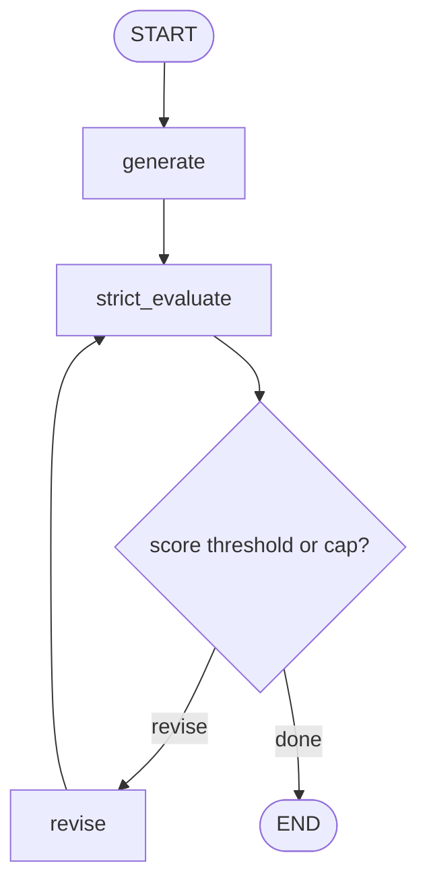

### 6. Agents

`6-agents/ex1_word_count_tool.py`

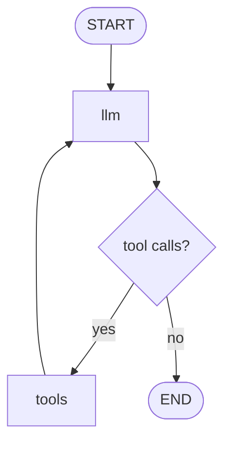

`6-agents/ex2_iteration_cap.py`

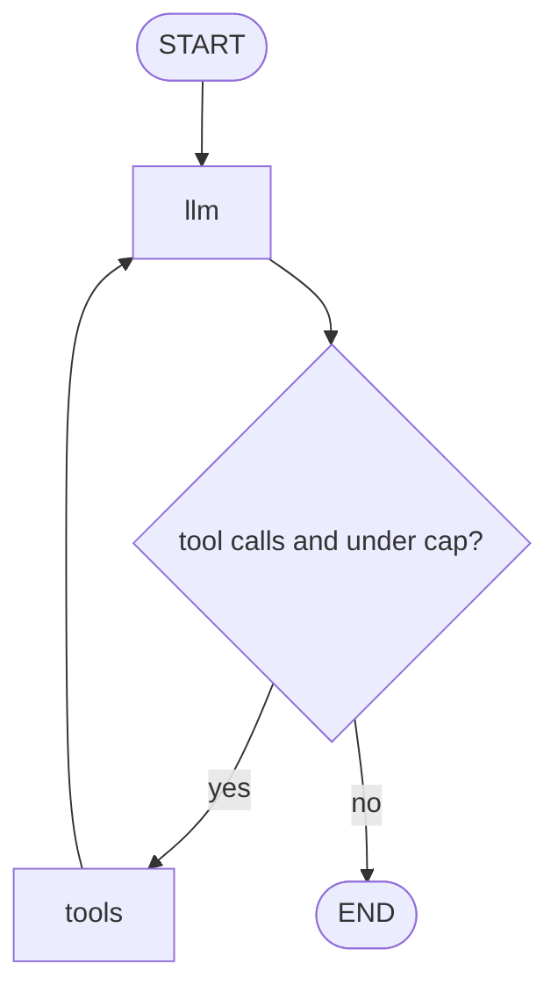

`6-agents/ex3_conversation_memory.py`

```mermaid
flowchart TD
    START([START]) --> LLM["llm"]
    LLM --> ROUTER{"tool calls?"}
    ROUTER -->|yes| TOOLS["tools"] --> LLM
    ROUTER -->|no| END([END])
```
