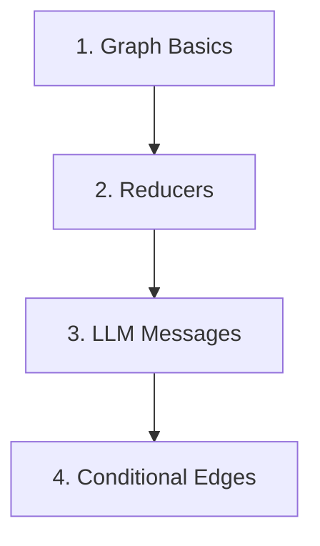
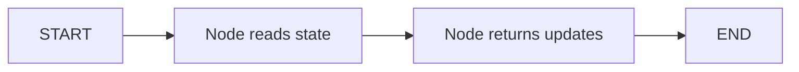

# LangGraph Tutorials

A small educational repo for learning LangGraph one concept at a time.

Each folder focuses on one idea, with simple code and comments so you can see how the graph works without extra complexity.

## Learning Path



## Concepts By Folder

| Folder | Concept | What You Learn |
|---|---|---|
| `1-Langgraph basics/` | Basic graph flow | Create a state, add a node, connect `START -> node -> END` |
| `2-Reducer/` | Reducers | Control how state updates are merged instead of replaced |
| `3_LLM_Messages/` | Message state | Store chat history and append new AI messages with `add_messages` |
| `Conditional Edges/` | Routing | Use a router function to choose the next node based on state |

## Key Idea

LangGraph lets you build workflows as graphs:



A node does work. State carries data. Edges decide where the graph goes next.

## Setup

```bash
python3 -m venv .venv
source .venv/bin/activate
pip install -r requirements.txt
```

## Run Examples

```bash
python "1-Langgraph basics/00_simple_graph.py"
python "Conditional Edges/05_conditional_edges.py"
```

For LLM examples, create a local `.env` file:

```bash
OPENAI_API_KEY=your_api_key_here
```

## Notes

- `graph.png`, `.env`, `.venv/`, caches, and personal notes are ignored by Git.
- Some examples call `plot_graph()`, which prints Mermaid and can save a graph image.
