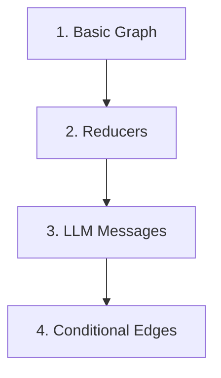

# LangGraph Tutorials

A beginner-friendly tutorial repo for learning LangGraph one concept at a time.

## Main Objective

This repo teaches LangGraph through small examples. Each folder focuses on one concept, explains the idea, shows the graph flow, and ends with a code explanation.

The goal is not to build a big app immediately. The goal is to understand the building blocks clearly.

## Learning Path



## Folders

| Folder | Topic | What You Learn |
|---|---|---|
| `1-Langgraph basics/` | Basic graph | State, node, edges, compile, invoke |
| `2-Reducer/` | Reducers | Difference between replacing state and merging state |
| `3_LLM_Messages/` | Message state | How chat history is stored and updated |
| `4-Conditional Edges/` | Routing | How the graph chooses different paths |

## Core Mental Model

LangGraph workflows are graphs. Data moves through the graph as state.


A node reads the current state and returns an update. Edges decide which node runs next.

## Setup

```bash
python3 -m venv .venv
source .venv/bin/activate
pip install -r requirements.txt
```

For LLM examples, create a local `.env` file:

```bash
OPENAI_API_KEY=your_api_key_here
```

## Suggested Order

Read and run the folders in this order:

1. `1-Langgraph basics/`
2. `2-Reducer/`
3. `3_LLM_Messages/`
4. `4-Conditional Edges/`

Each folder has its own README tutorial.

## Code Explanation

Most examples follow this pattern:

```python
graph = StateGraph(StateSchema)
graph.add_node("node_name", node_function)
graph.add_edge(START, "node_name")
graph.add_edge("node_name", END)
app = graph.compile()
result = app.invoke(initial_state)
```

Line by line:

- `StateGraph(StateSchema)` creates a graph with a specific state shape.
- `add_node()` registers a Python function as a graph step.
- `add_edge()` connects graph steps together.
- `compile()` turns the graph definition into a runnable app.
- `invoke()` runs the graph with an initial state.
