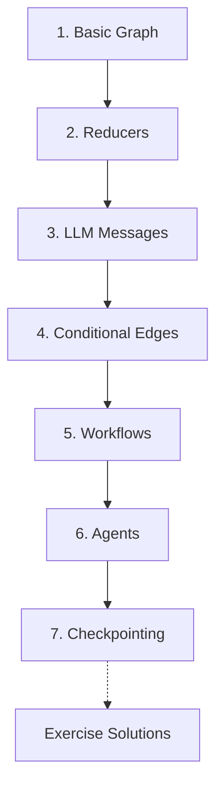

# LangGraph Tutorials

A beginner-friendly tutorial repo for learning LangGraph one concept at a time.

This repo is meant to feel like a guided path, not a code dump. Each folder introduces one idea, explains why it matters, then uses a small Python file to make the idea concrete.

## Prerequisites

- Python 3.10 or newer
- Basic Python (functions, dictionaries, classes)
- An OpenAI API key for LLM examples in tutorials 3, 5, 6, 7, and some exercise solutions

For deeper reference, see the [official LangGraph documentation](https://docs.langchain.com/oss/python/langgraph/overview).

This repo intentionally follows the official LangGraph mental model: define **state**, run **nodes**, connect them with **edges**, then compile the graph into something you can invoke. The examples are small so the idea is visible before the code becomes realistic.

## Part 1 — Core Tutorial Roadmap

LangGraph lets you build workflows as graphs. A graph is made of three main pieces:

| Piece | Meaning | Simple Way To Think About It |
|---|---|---|
| State | Data moving through the graph | The backpack your workflow carries |
| Node | A function that does work | A step in the workflow |
| Edge | A connection between nodes | The road to the next step |


The learning path builds up slowly:



Each tutorial follows the same rhythm:

1. Part 1 teaches the core concept in plain language
2. Part 2 uses a small code example to make that concept concrete
3. the final Code Explanation connects important code lines back to the concept

## Folder Guide

| Folder | Tutorial Focus | Why It Matters |
|---|---|---|
| `1-Langgraph basics/` | Build the smallest possible graph | Learn the core shape: state, node, edge, compile, invoke |
| `2-Reducer/` | Compare state updates with and without reducers | Understand how LangGraph preserves or combines state |
| `3_LLM_Messages/` | Store chat history in graph state | Learn how LLM conversations fit into LangGraph |
| `4-Conditional Edges/` | Route to different nodes | Learn how graphs make decisions |
| `5-Workflows/` | Workflow patterns | Larger LLM designs such as routing, parallel work, orchestration, and evaluation loops |
| `6-Agents/` | Agent patterns | Dynamic loops where the LLM decides whether to call tools and continue |
| `7-Checkpointing/` | Persist state across runs | Learn how graphs remember conversation history using MemorySaver or manual history passing |
| `Exercise-Solutions/` | Practice solutions | Runnable answers for the exercises at the end of each tutorial |

## Setup

From the repo root:

```bash
python3 -m venv .venv
source .venv/bin/activate
pip install -r requirements.txt
```

For LLM examples, create a local `.env` file in the repo root:

```bash
OPENAI_API_KEY=your_api_key_here
```

For the tool-calling agent, optionally add API keys for live weather and web search:

```bash
OPENWEATHER_API_KEY=your_openweather_key_here
TAVILY_API_KEY=your_tavily_key_here
```

## Suggested Order

Read and run the folders in order:

1. [`1-Langgraph basics/`](1-Langgraph%20basics/)
2. [`2-Reducer/`](2-Reducer/)
3. [`3_LLM_Messages/`](3_LLM_Messages/)
4. [`4-Conditional Edges/`](4-Conditional%20Edges/)
5. [`5-Workflows/`](5-Workflows/)
6. [`6-Agents/`](6-Agents/)
7. [`7-Checkpointing/`](7-Checkpointing/)

Use [`Exercise-Solutions/`](Exercise-Solutions/) after trying the exercises yourself.

Each tutorial folder has its own README that works like a mini lesson.

## Troubleshooting

| Problem | Fix |
|---|---|
| `ModuleNotFoundError: No module named 'langgraph'` | Activate the virtual environment and run `pip install -r requirements.txt` |
| `OpenAI` authentication error in tutorials 3, 5, 6, or 7 | Check that `.env` exists in the repo root and contains a valid `OPENAI_API_KEY` |
| Run commands fail with "file not found" | Run commands from the repo root, not from inside a tutorial folder |

## Official References Used

These tutorials are enriched from the official LangChain and LangGraph docs, then simplified into beginner examples:

- [LangGraph overview](https://docs.langchain.com/oss/python/langgraph/overview)
- [LangGraph Graph API](https://docs.langchain.com/oss/python/langgraph/graph-api)
- [LangGraph workflows and agents](https://docs.langchain.com/oss/python/langgraph/workflows-agents)
- [LangChain tools](https://docs.langchain.com/oss/python/langchain/tools)
- [LangChain structured output](https://docs.langchain.com/oss/python/langchain/structured-output)

## Getting Started

Tutorial 1 walks through the core graph pattern step by step. Once you understand that shape, the rest of the series builds on it. Start with [`1-Langgraph basics/README.md`](1-Langgraph%20basics/README.md).
