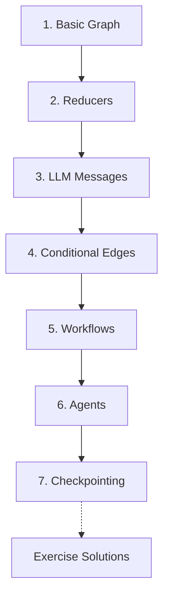

# LangGraph Tutorials

A beginner-friendly tutorial repo for learning LangGraph one concept at a time.

This repo is meant to feel like a guided path, not a code dump. Each folder introduces one idea, explains why it matters, then uses a small Python file to make the idea concrete.

## Prerequisites

- Python 3.10 or newer
- Basic Python (functions, dictionaries, classes)
- An OpenAI API key for LLM examples in tutorials 3, 5, 6, 7, and some exercise solutions

For deeper reference, see the [official LangGraph documentation](https://docs.langchain.com/oss/python/langgraph/overview).

This repo intentionally follows the official LangGraph mental model: define **state**, run **nodes**, connect them with **edges**, then compile the graph into something you can invoke. The examples are small so the idea is visible before the code becomes realistic.

## Part 1 — Core Tutorial Roadmap

LangGraph lets you build workflows as graphs. A graph is made of three main pieces:

| Piece | Meaning | Simple Way To Think About It |
|---|---|---|
| State | Data moving through the graph | The backpack your workflow carries |
| Node | A function that does work | A step in the workflow |
| Edge | A connection between nodes | The road to the next step |


The learning path builds up slowly:



Each tutorial follows the same rhythm:

1. the concept and the problem it solves, in plain language with an intuition-building analogy
2. the architecture of the example — a diagram and a table of what each stage reads and writes
3. code highlights explaining *why* the important lines are designed the way they are
4. a step-by-step execution walkthrough showing how state evolves
5. exercises (with solutions in `Exercise-Solutions/`) and key takeaways

## Folder Guide

| Folder | Tutorial Focus | Why It Matters |
|---|---|---|
| `1-Langgraph basics/` | Build the smallest possible graph | Learn the core shape: state, node, edge, compile, invoke |
| `2-Reducer/` | Compare state updates with and without reducers | Understand how LangGraph preserves or combines state |
| `3_LLM_Messages/` | Store chat history in graph state | Learn how LLM conversations fit into LangGraph |
| `4-Conditional Edges/` | Route to different nodes | Learn how graphs make decisions |
| `5-Workflows/` | Workflow patterns | Larger LLM designs such as routing, parallel work, orchestration, and evaluation loops |
| `6-Agents/` | Agent patterns | Dynamic loops where the LLM decides whether to call tools and continue |
| `7-Checkpointing/` | Persist state across runs | Learn thread memory with `MemorySaver`, durable checkpoints with `PostgresSaver`, and how this differs from long-term memory |
| `Exercise-Solutions/` | Practice solutions | Runnable answers for the exercises at the end of each tutorial |


## Memory Types in This Repo

LangGraph uses the word "memory" in a few related ways. This repo separates them so the ideas do not blur together:

| Memory Type | Scope | Stored In | Survives Python Restart? | Covered In |
|---|---|---|---|---|
| No memory | one isolated invoke | nowhere | no | `7-Checkpointing/02-memory-saver/00_no_memory.py` |
| Manual history | caller-managed conversation | your Python variable / app code | only if your app saves it | `7-Checkpointing/02-memory-saver/02_manual_history.py` |
| `MemorySaver` | one LangGraph thread | Python process memory | no | `7-Checkpointing/02-memory-saver/01_memory_saver.py` |
| `PostgresSaver` | many durable LangGraph threads, each keyed by `thread_id` | PostgreSQL checkpoint tables | yes | `7-Checkpointing/08-postgres-saver/` |
| Long-term memory / `Store` | cross-thread user or app facts | a store such as `PostgresStore` | yes | explained conceptually; not a full code section yet |

The most important distinction:

```text
MemorySaver    = temporary thread memory
PostgresSaver  = durable thread memory
Store          = durable user/app memory across threads
```

`PostgresSaver` can hold many conversations, but each one is still separate by `thread_id`. It remembers this thread:

```text
thread_id = "chat_session_walid"
→ messages and graph state for that conversation
```

Long-term memory is different. It is usually keyed by a stable user or application id and can be reused across many threads:

```text
user_id = "walid"
→ preferences, profile, durable facts
```

So persistence alone does not mean "long-term memory." `PostgresSaver` persists checkpoints; `Store` is where cross-conversation facts belong.

## Setup

From the repo root:

```bash
python3 -m venv .venv
source .venv/bin/activate
pip install -r requirements.txt
```

For LLM examples, create a local `.env` file in the repo root:

```bash
OPENAI_API_KEY=your_api_key_here
```

For the tool-calling agent, optionally add API keys for live weather and web search:

```bash
OPENWEATHER_API_KEY=your_openweather_key_here
TAVILY_API_KEY=your_tavily_key_here
```

## Suggested Order

Read and run the folders in order:

1. [`1-Langgraph basics/`](1-Langgraph%20basics/)
2. [`2-Reducer/`](2-Reducer/)
3. [`3_LLM_Messages/`](3_LLM_Messages/)
4. [`4-Conditional Edges/`](4-Conditional%20Edges/)
5. [`5-Workflows/`](5-Workflows/)
6. [`6-Agents/`](6-Agents/)
7. [`7-Checkpointing/`](7-Checkpointing/)

Use [`Exercise-Solutions/`](Exercise-Solutions/) after trying the exercises yourself.

Each tutorial folder has its own README that works like a mini lesson.

## Troubleshooting

| Problem | Fix |
|---|---|
| `ModuleNotFoundError: No module named 'langgraph'` | Activate the virtual environment and run `pip install -r requirements.txt` |
| `OpenAI` authentication error in tutorials 3, 5, 6, or 7 | Check that `.env` exists in the repo root and contains a valid `OPENAI_API_KEY` |
| Run commands fail with "file not found" | Run commands from the repo root, not from inside a tutorial folder |

## Official References Used

These tutorials are enriched from the official LangChain and LangGraph docs, then simplified into beginner examples:

- [LangGraph overview](https://docs.langchain.com/oss/python/langgraph/overview)
- [LangGraph Graph API](https://docs.langchain.com/oss/python/langgraph/graph-api)
- [LangGraph workflows and agents](https://docs.langchain.com/oss/python/langgraph/workflows-agents)
- [LangChain tools](https://docs.langchain.com/oss/python/langchain/tools)
- [LangChain structured output](https://docs.langchain.com/oss/python/langchain/structured-output)

## Getting Started

Tutorial 1 walks through the core graph pattern step by step. Once you understand that shape, the rest of the series builds on it. Start with [`1-Langgraph basics/README.md`](1-Langgraph%20basics/README.md).
