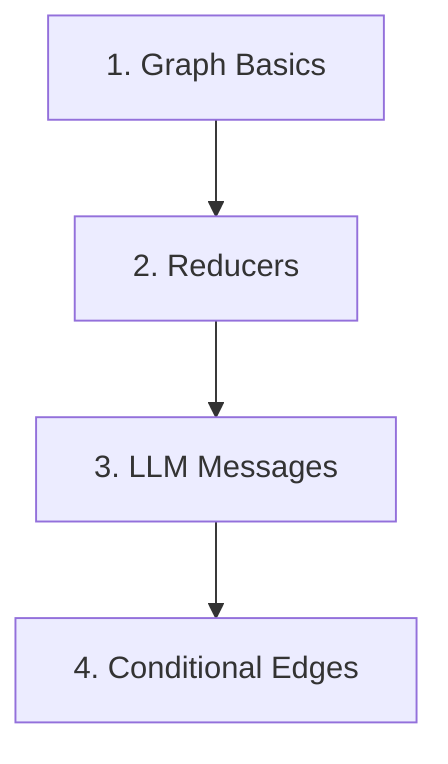
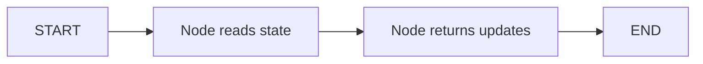

# LangGraph Tutorials

An educational repo for learning LangGraph one concept at a time.

## Main Objective

The goal of this repo is to make LangGraph easier to understand through small, focused examples.

Each folder picks one core concept, explains it with simple code, and shows how that concept fits into a graph workflow.

## Learning Path



## Folders And What They Cover

| Folder | Covers | Main Idea |
|---|---|---|
| `1-Langgraph basics/` | Simple graph structure | Build your first graph with state, one node, and `START -> node -> END` |
| `2-Reducer/` | Reducers and state merging | Learn how reducers control whether state values are replaced, added, or appended |
| `3_LLM_Messages/` | LLM chat messages | Learn how message history is stored and updated with `add_messages` |
| `Conditional Edges/` | Conditional routing | Learn how a router function chooses the next node based on the current state |
| `util.py` | Shared helper functions | Contains reusable helper code like `plot_graph()` for visualizing graphs |

## Key Idea

LangGraph lets you build workflows as graphs:



A node does work. State carries data. Edges decide where the graph goes next.

## Setup

```bash
python3 -m venv .venv
source .venv/bin/activate
pip install -r requirements.txt
```

## Run Examples

```bash
python "1-Langgraph basics/00_simple_graph.py"
python "Conditional Edges/05_conditional_edges.py"
```

For LLM examples, create a local `.env` file:

```bash
OPENAI_API_KEY=your_api_key_here
```

## Notes

- `graph.png`, `.env`, `.venv/`, caches, and personal notes are ignored by Git.
- Some examples call `plot_graph()`, which prints Mermaid and can save a graph image.
