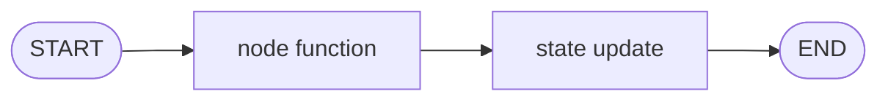
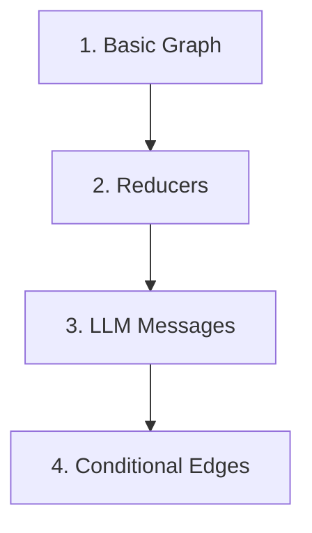

# LangGraph Tutorials

A beginner-friendly tutorial repo for learning LangGraph one concept at a time.

This repo is meant to feel like a guided path, not a code dump. Each folder introduces one idea, explains why it matters, then uses a small Python file to make the idea concrete.

## Part 1 — Concept Roadmap

LangGraph lets you build workflows as graphs. A graph is made of three main pieces:

| Piece | Meaning | Simple Way To Think About It |
|---|---|---|
| State | Data moving through the graph | The backpack your workflow carries |
| Node | A function that does work | A step in the workflow |
| Edge | A connection between nodes | The road to the next step |



The learning path builds up slowly:



## Folder Guide

| Folder | Tutorial Focus | Why It Matters |
|---|---|---|
| `1-Langgraph basics/` | Build the smallest possible graph | Learn the core shape: state, node, edge, compile, invoke |
| `2-Reducer/` | Compare state updates with and without reducers | Understand how LangGraph preserves or combines state |
| `3_LLM_Messages/` | Store chat history in graph state | Learn how LLM conversations fit into LangGraph |
| `4-Conditional Edges/` | Route to different nodes | Learn how graphs make decisions |

## Setup

```bash
python3 -m venv .venv
source .venv/bin/activate
pip install -r requirements.txt
```

For LLM examples, create a local `.env` file:

```bash
OPENAI_API_KEY=your_api_key_here
```

## Suggested Order

Read and run the folders in order:

1. `1-Langgraph basics/`
2. `2-Reducer/`
3. `3_LLM_Messages/`
4. `4-Conditional Edges/`

Each folder has its own README that works like a mini tutorial.

## Part 2 — Code Illustration

Most examples use this same shape:

```python
graph = StateGraph(StateSchema)
graph.add_node("node_name", node_function)
graph.add_edge(START, "node_name")
graph.add_edge("node_name", END)
app = graph.compile()
result = app.invoke(initial_state)
```

Line by line:

- `StateGraph(StateSchema)` creates a graph with a specific state shape.
- `add_node()` registers a Python function as a graph step.
- `add_edge()` connects one step to the next.
- `compile()` turns the graph definition into a runnable app.
- `invoke()` runs the app with an initial state.
