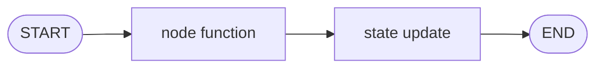
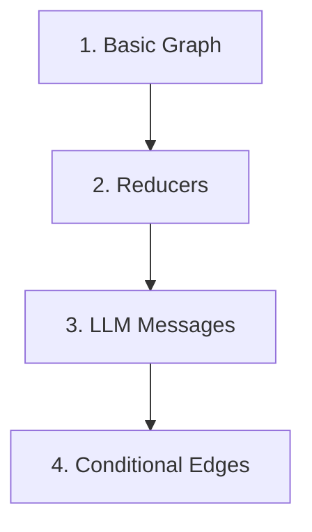

# LangGraph Tutorials

A beginner-friendly tutorial repo for learning LangGraph one concept at a time.

This repo is meant to feel like a guided path, not a code dump. Each folder introduces one idea, explains why it matters, then uses a small Python file to make the idea concrete.

## Prerequisites

- Python 3.10 or newer
- Basic Python (functions, dictionaries, classes)
- An OpenAI API key for tutorial 3 only (the LLM chatbot example)

For deeper reference, see the [official LangGraph documentation](https://langchain-ai.github.io/langgraph/).

## Part 1 — Concept Roadmap

LangGraph lets you build workflows as graphs. A graph is made of three main pieces:

| Piece | Meaning | Simple Way To Think About It |
|---|---|---|
| State | Data moving through the graph | The backpack your workflow carries |
| Node | A function that does work | A step in the workflow |
| Edge | A connection between nodes | The road to the next step |



The learning path builds up slowly:



## Folder Guide

| Folder | Tutorial Focus | Why It Matters |
|---|---|---|
| `1-Langgraph basics/` | Build the smallest possible graph | Learn the core shape: state, node, edge, compile, invoke |
| `2-Reducer/` | Compare state updates with and without reducers | Understand how LangGraph preserves or combines state |
| `3_LLM_Messages/` | Store chat history in graph state | Learn how LLM conversations fit into LangGraph |
| `4-Conditional Edges/` | Route to different nodes | Learn how graphs make decisions |

## Setup

From the repo root:

```bash
python3 -m venv .venv
source .venv/bin/activate
pip install -r requirements.txt
```

For the LLM example in tutorial 3, create a local `.env` file in the repo root:

```bash
OPENAI_API_KEY=your_api_key_here
```

## Suggested Order

Read and run the folders in order:

1. [`1-Langgraph basics/`](1-Langgraph%20basics/)
2. [`2-Reducer/`](2-Reducer/)
3. [`3_LLM_Messages/`](3_LLM_Messages/)
4. [`4-Conditional Edges/`](4-Conditional%20Edges/)

Each folder has its own README that works like a mini tutorial.

## Troubleshooting

| Problem | Fix |
|---|---|
| `ModuleNotFoundError: No module named 'langgraph'` | Activate the virtual environment and run `pip install -r requirements.txt` |
| `OpenAI` authentication error in tutorial 3 | Check that `.env` exists in the repo root and contains a valid `OPENAI_API_KEY` |
| Run commands fail with "file not found" | Run commands from the repo root, not from inside a tutorial folder |

## Getting Started

Tutorial 1 walks through the core graph pattern step by step. Once you understand that shape, the rest of the series builds on it. Start with [`1-Langgraph basics/README.md`](1-Langgraph%20basics/README.md).
