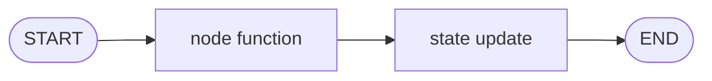
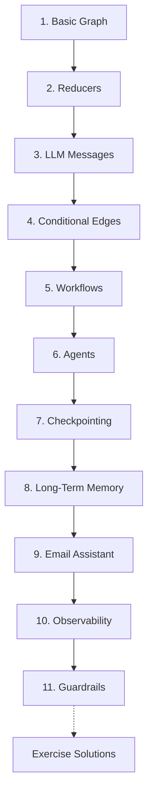

# LangGraph Tutorials

A beginner-friendly tutorial repo for learning LangGraph one concept at a time. It is the companion code for the book *Building AI Agents with LangGraph*.

This repo is meant to feel like a guided path, not a code dump. Each folder introduces one idea, explains why it matters, then uses a small Python file to make the idea concrete.

You need basic Python (functions, dictionaries, classes). An OpenAI API key is needed from tutorial 3 onward; tutorials 1, 2 and 4 run without one.

## Quick Start

Python 3.10 or newer is required. From the repo root:

```bash
python3 -m venv .venv
source .venv/bin/activate
pip install -r requirements.txt
```

Most tutorials call an LLM. Create a `.env` file in the repo root:

```bash
OPENAI_API_KEY=your_api_key_here
```

For the tool-calling agent in tutorial 6, optionally add keys for live weather and web search:

```bash
OPENWEATHER_API_KEY=your_openweather_key_here
TAVILY_API_KEY=your_tavily_key_here
```

Tutorial 10 reads its LangSmith keys from `10-observability/.env` (see its README). Tutorials 7 and 8 have optional PostgreSQL examples with their own setup guides.

Then run the first example, always from the repo root:

```bash
python "1-Langgraph basics/00_simple_graph.py"
```

## The Core Idea

LangGraph lets you build workflows as graphs. A graph is made of three main pieces:

| Piece | Meaning | Simple Way To Think About It |
|---|---|---|
| State | Data moving through the graph | The backpack your workflow carries |
| Node | A function that does work | A step in the workflow |
| Edge | A connection between nodes | The road to the next step |


```mermaid
flowchart LR
    START([START]) --> NODE["node function"]
    NODE --> UPDATE["state update"]
    UPDATE --> END([END])
```

This repo follows the official LangGraph mental model: define **state**, run **nodes**, connect them with **edges**, then compile the graph into something you can invoke. The examples are small so the idea is visible before the code becomes realistic.

## Learning Path

The tutorials build on each other, so work through them in order:


```mermaid
flowchart TD
    A["1. Basic Graph"] --> B["2. Reducers"]
    B --> C["3. LLM Messages"]
    C --> D["4. Conditional Edges"]
    D --> E["5. Workflows"]
    E --> F["6. Agents"]
    F --> G["7. Checkpointing"]
    G --> H["8. Long-Term Memory"]
    H --> I["9. Email Assistant"]
    I --> K["10. Observability"]
    K --> L["11. Guardrails"]
    L -.-> J["Exercise Solutions"]
```

| # | Folder | What you learn | Needs |
|---|---|---|---|
| 1 | [`1-Langgraph basics/`](1-Langgraph%20basics/) | The smallest graph: state, node, edge, compile, invoke | — |
| 2 | [`2-Reducer/`](2-Reducer/) | How reducers preserve or combine state updates | — |
| 3 | [`3_LLM_Messages/`](3_LLM_Messages/) | Chat history in graph state | OpenAI |
| 4 | [`4-Conditional Edges/`](4-Conditional%20Edges/) | Routing to different nodes | — |
| 5 | [`5-Workflows/`](5-Workflows/) | Prompt chaining, routing, parallelization, orchestrator-workers, evaluator-optimizer, local RAG | OpenAI |
| 6 | [`6-Agents/`](6-Agents/) | Manual routers, `Command`, `ToolNode`, `create_agent`, two-agent handoff | OpenAI (optional: weather, Tavily) |
| 7 | [`7-Checkpointing/`](7-Checkpointing/) | Short-term memory per `thread_id`: `MemorySaver`, history, resume, human-in-the-loop, `PostgresSaver` | OpenAI; PostgreSQL for the last step |
| 8 | [`8-Long-Term-Memory/`](8-Long-Term-Memory/) | Cross-conversation memory with a Store: namespaces, `PostgresStore`, semantic/episodic/procedural memory | OpenAI; PostgreSQL for `03-postgres-store/` |
| 9 | [`9-Email-Assistant/`](9-Email-Assistant/) | A complete assistant built gradually: routing, tools, and every memory type | OpenAI |
| 10 | [`10-observability/`](10-observability/) | LangSmith tracing of graphs, LLM calls and nodes | OpenAI, LangSmith |
| 11 | [`11-Guardrials/`](11-Guardrials/) | Guardrails with LangChain middleware: PII detection, human-in-the-loop, input/output checks (notebook) | OpenAI |
| — | [`Exercise-Solutions/`](Exercise-Solutions/) | Runnable answers to the end-of-tutorial exercises (1–6). Try the exercises first | OpenAI for some |

Each folder has its own README that works like a mini lesson. Each one follows the same rhythm:

1. the concept and the problem it solves, in plain language with an intuition-building analogy
2. the architecture of the example — a diagram and a table of what each stage reads and writes
3. code highlights explaining *why* the important lines are designed the way they are
4. a step-by-step execution walkthrough showing how state evolves
5. exercises (with solutions in `Exercise-Solutions/`) and key takeaways

## Memory in This Repo

LangGraph uses the word "memory" for two different scopes, and this repo
teaches them in two separate tutorials:

| Scope | Remembers | Identified by | Temporary / durable | Tutorial |
|---|---|---|---|---|
| Short-term | one conversation's messages and graph state | `thread_id` | `MemorySaver` / `PostgresSaver` | [`7-Checkpointing/`](7-Checkpointing/) |
| Long-term | selected user or app facts shared across conversations | namespace containing `user_id` | `InMemoryStore` / `PostgresStore` | [`8-Long-Term-Memory/`](8-Long-Term-Memory/) |

[`9-Email-Assistant/`](9-Email-Assistant/) then combines both in one
application. The details (savers, Stores, and semantic, episodic and
procedural memory) live in those tutorials' READMEs.

## Troubleshooting

| Problem | Fix |
|---|---|
| `ModuleNotFoundError: No module named 'langgraph'` | Activate the virtual environment and run `pip install -r requirements.txt` |
| `OpenAI` authentication error in tutorials 3 and 5–11 | Check that `.env` exists in the repo root and contains a valid `OPENAI_API_KEY` |
| Tutorial 10 cannot find `.env` or LangSmith keys | Copy `10-observability/.env.example` to `10-observability/.env`. Those scripts load env from **that** folder, not the repo root. Run 01–02 as `python 01_….py` and file 03 as `python 03_multi_tool_agent/main.py` from `10-observability/` |
| Run commands fail with "file not found" | Run commands from the repo root, not from inside a tutorial folder (except tutorial 10 — run from `10-observability/`) |

## Official References Used

These tutorials are enriched from the official LangChain and LangGraph docs, then simplified into beginner examples:

- [LangGraph overview](https://docs.langchain.com/oss/python/langgraph/overview)
- [LangGraph Graph API](https://docs.langchain.com/oss/python/langgraph/graph-api)
- [LangGraph workflows and agents](https://docs.langchain.com/oss/python/langgraph/workflows-agents)
- [LangGraph memory](https://docs.langchain.com/oss/python/langgraph/add-memory)
- [LangChain tools](https://docs.langchain.com/oss/python/langchain/tools)
- [LangChain structured output](https://docs.langchain.com/oss/python/langchain/structured-output)

## Tested Versions and Updates

The book *Building AI Agents with LangGraph* was written against the versions pinned in [`requirements.txt`](requirements.txt) (current as of September 2026), including `langgraph==1.2.6`, `langchain==1.3.11`, `langchain-openai==1.3.3` and `langmem==0.0.30`. Install that file and every example runs as printed in the book.

LangGraph moves quickly. When an upgrade changes an import or a default, the examples here are updated and the change is logged below, so readers of the printed book can see what moved.

| Date | Library change | What changed in this repo |
|---|---|---|
| 2026-09 | — | Baseline for the first edition. |
